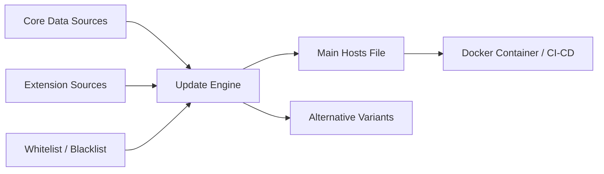

# StevenBlack/hosts

> Fichier hosts unifié et dédoublonné, agrégé depuis des listes tierces, pour bloquer publicités et sites malveillants.

## Le problème
Bloquer régies publicitaires, traqueurs et domaines douteux sur tous les appareils, sans maintenir soi-même des dizaines de listes.

## Ce que ça fait vraiment
Agrège des fichiers hosts de sources tierces (AdAway, MVPS, URLHaus, yoyo.org…), les fusionne, retire les doublons et publie la base (76 229 entrées) plus 31 variantes avec extensions optionnelles : fakenews, jeux d'argent, pornographie, réseaux sociaux. Un script Python (`updateHostsFile.py`) régénère le fichier, avec liste blanche, liste noire et entrées perso. Les domaines sont redirigés vers `0.0.0.0`.

## Comment c'est branché


## Essayer
```bash
git clone --depth 1 https://github.com/StevenBlack/hosts.git
pip3 install --user -r requirements.txt
python3 updateHostsFile.py [--auto] [--replace] [--ip nnn.nnn.nnn.nnn] [--extensions ext1 ext2 ext3]
docker run --pull always --rm -it -v /etc/hosts:/etc/hosts \
ghcr.io/stevenblack/hosts:latest updateHostsFile.py --auto \
--replace --extensions gambling porn
```

## Coût et pièges
Gratuit. L'option Docker remplace `/etc/hosts`. Sous Windows, un gros fichier peut imposer de désactiver le service DNS Cache ou de compresser la liste. Cloner tout l'historique est long : utiliser `--depth 1`.

## Ce que ce n'est pas
Ce n'est pas un pare-feu ni un antivirus : un blocage par nom de domaine seulement. Le dépôt est MIT, mais certaines sources agrégées ont leurs propres licences (CC BY-NC-SA 4.0 pour MVPS, « non-commercial » pour someonewhocares) : à vérifier avant tout usage commercial. Les signalements de contenu se font auprès de la source d'origine.

## Alternatives
- Pi-hole : blocage à l'échelle du réseau, qui utilise ce dépôt comme source.
- dnscrypt-proxy : construit des listes de blocage à partir de formats courants.
- Unbound : résolveur DNS pouvant charger ces listes.

## Pour toi
À adopter : un moyen simple et éprouvé de filtrer les domaines publicitaires sur postes et serveurs, mais contrôle la licence des sources si tu redistribues.

