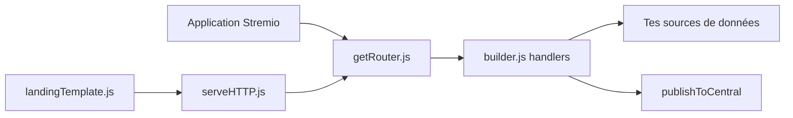

# Stremio/stremio-addon-sdk

> SDK Node.js officiel pour écrire des addons Stremio (catalogues, métadonnées, flux, sous-titres).

## Le problème
Un addon Stremio doit répondre à un protocole HTTP/JSON précis, avec CORS et manifest, ce qui est répétitif à écrire.

## Ce que ça fait vraiment
Un `addonBuilder` déclare le manifest et les handlers (catalog, meta, stream, subtitles, addon_catalog) ; `serveHTTP` lance un serveur, `getRouter` monte l'addon en routeur Express. Il fournit CORS, une page d'installation, des types TypeScript et `publishToCentral` pour référencer l'addon. Stremio n'exécute jamais ton code : il appelle tes endpoints.

## Comment c'est branché


## Essayer
```bash
npm install -g stremio-addon-sdk
addon-bootstrap hello-world
cd hello-world
npm install
npm start -- --launch
```

## Coût et pièges
Gratuit. L'addon doit être joignable en HTTPS avec CORS (hors 127.0.0.1) ; l'hébergement est à ta charge (BeamUp suggéré). 78 issues ouvertes.

## Ce que ce n'est pas
Ce n'est pas un fournisseur de contenu : l'SDK ne fournit aucune source de vidéos.

## Alternatives
stremio-addon-sdk-rs (Rust, tiers) et go-stremio (Go, tiers), cités dans le README, pour d'autres langages.

## Pour toi
À ignorer : bon SDK mais pour l'écosystème média Stremio, sans rapport avec data, IA ou MLOps.

