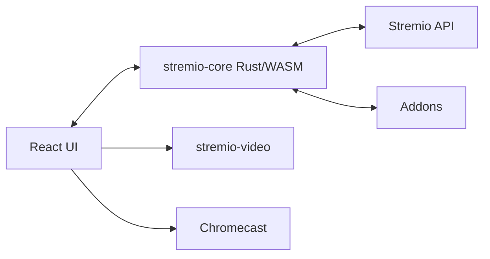

# Stremio/stremio-web

> Interface web officielle de Stremio, centre multimédia alimenté par des addons, pour spectateurs.

## Le problème
Regrouper films, séries et chaînes de sources multiples dans une seule interface synchronisée entre appareils.

## Ce que ça fait vraiment
Application React ; la logique (état, protocole d'addons, bibliothèque, synchro) est dans stremio-core, un moteur Rust compilé en WebAssembly dans un Web Worker. Lecture via stremio-video. Prend en charge Chromecast, sous-titres, 50+ langues, PWA installable.

## Comment c'est branché


## Essayer
```bash
pnpm install
pnpm start
docker build -t stremio-web .
docker run -p 8080:8080 stremio-web
```

## Coût et pièges
Gratuit ; Node.js 22+ et pnpm 11+. Le contenu dépend d'addons tiers et du compte Stremio.

## Ce que ce n'est pas
Pas le moteur : le « cerveau » est dans stremio-core, autre dépôt. Ne fournit pas de contenu.

## Alternatives
Aucune alternative citée dans le README.

## Pour toi
À ignorer : application de divertissement sans rapport avec data/IA ; seul l'exemple React + Rust/WASM peut intéresser.

