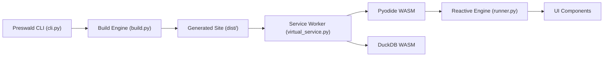

# StructuredLabs/preswald

> Générateur de sites statiques pour applications de données interactives en Python, qui tournent hors ligne dans le navigateur.

## Le problème
Livrer un tableau de bord ou un rapport interactif oblige souvent à héberger un serveur, ou à demander au destinataire d'installer Python. Ici, tout doit tenir dans un dossier ouvrable dans un navigateur.

## Ce que ça fait vraiment
On écrit l'application en Python (composants `text`, `table`, `get_df`…). `preswald export` produit un site statique dans `dist/` qui embarque le code, les données, Pyodide (Python en WebAssembly) et DuckDB WASM pour les requêtes SQL. Un moteur réactif à graphe de dépendances ne relance que ce qui change. Un service worker joue le rôle de système de fichiers virtuel. La description d'architecture signale un module `telemetry.py` qui envoie, en option, des métriques d'usage anonymes.

## Comment c'est branché


## Essayer
```bash
pip install preswald
preswald init my_app
cd my_app
preswald run
preswald export
```

## Coût et pièges
Gratuit. `preswald run` lance un serveur de développement sur `localhost:8501`. Les secrets vont dans `secrets.toml` : ne pas les exporter dans `dist/`. Le comportement exact de la télémétrie n'est pas décrit dans le README : à vérifier dans le code avant un usage sur données sensibles.

## Ce que ce n'est pas
Ce n'est pas un serveur d'applications : il n'y a pas de backend à l'exécution. Les données sont embarquées dans le bundle, ce qui pose une limite de taille et de confidentialité dès qu'on partage le fichier. Le README parle de « données volumineuses » sans donner de chiffre.

## Alternatives
Aucune alternative nommée dans le README (il évoque seulement des « plateformes d'applications web plus lourdes »).

## Pour toi
À surveiller : l'idée de livrer un rapport de données en un seul dossier hors ligne est utile, mais 330 issues ouvertes et une télémétrie à auditer justifient un essai sur un jeu de données non sensible avant de l'adopter.
