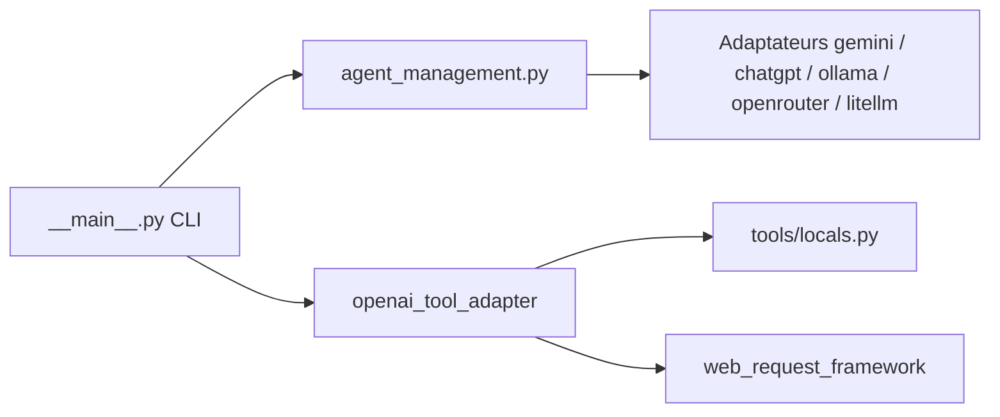

# SudoHopeX/KaliGPT

> Assistant IA en ligne de commande pour Linux, orienté cybersécurité, qui route vers plusieurs fournisseurs de modèles.

## Le problème
Interroger un modèle sur des tâches de sécurité oblige à quitter le terminal et à jongler entre fournisseurs.

## Ce que ça fait vraiment
- La commande `kaligpt` envoie un prompt à Gemini (défaut), Ollama, OpenRouter, OpenAI ou LiteLLM.
- Un mode agent expose des outils : actions locales sur la machine (`locals.py`), requêtes web, recherche via OpenSearchAPI.
- Change de modèle en session (`/change-model`), gère les clés, ouvre les chats web officiels.
- Installeurs pour Arch, Debian-like et Termux.

## Comment c'est branché


## Essayer
```bash
curl -sL https://raw.githubusercontent.com/SudoHopeX/KaliGPT/refs/heads/hackerx/install.sh | bash
sudo bash kaligptinstaller.sh
kaligpt -h
kaligpt -g "How to Scan a website for subdomains using tools"
```

## Coût et pièges
Clé d'API pour les fournisseurs en ligne ; Ollama en local sinon. L'installation passe par un `curl | bash`, et les outils locaux donnent au modèle une prise sur ta machine.

## Ce que ce n'est pas
Ce n'est pas un outil stabilisé : le README prévient qu'il est en développement actif. Ce n'est pas un droit d'usage sur des cibles tierces : le README interdit tout usage non autorisé. La licence n'est pas identifiée.

## Alternatives
Aucune alternative nommée dans le README.

## Pour toi
À ignorer : un routeur de prompts au-dessus de fournisseurs que tu peux déjà appeler, mainteneur unique, licence floue et installation par script distant.
