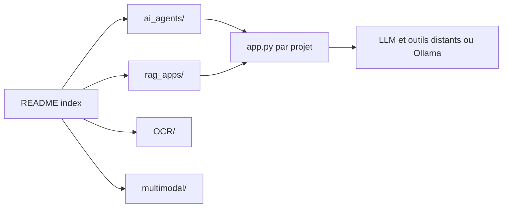

# Sumanth077/Hands-On-AI-Engineering

> Monorepo de dizaines de petits projets IA (agents, RAG, OCR, audio, multimodal) pour apprendre par l'exemple.

## Le problème
Trouver des exemples complets et exécutables d'agents ou de RAG, sans les reconstituer depuis des extraits de doc.

## Ce que ça fait vraiment
Chaque projet vit dans son dossier (`ai_agents/`, `rag_apps/`, `OCR/`, `audio/`, `multimodal/`, `fine_tuning/`) avec son `app.py`, ses dépendances et son `.env.example`. Le README liste plus de quarante agents (recherche multi-agents, analyse financière, SQL en langage naturel, revue de PR…), des variantes de RAG (graphe, hybride, HyDE, routage de bases), de l'OCR médical et un exemple de fine-tuning. Il n'y a pas de socle commun.

## Comment c'est branché

## Essayer
Aucune commande n'est documentée à la racine : chaque dossier de projet a son README. Le README impose `requirements.txt` ou `pyproject.toml` et `.env.example` dans chaque projet.

## Coût et pièges
Les fournisseurs varient (OpenAI, Anthropic, Gemini, Mistral, DeepSeek, MiniMax, NVIDIA NIM) : autant de clés, souvent payantes. Certains exemples tournent en local avec Ollama ou llama.cpp. Environnement à créer par projet.

## Ce que ce n'est pas
Pas une bibliothèque ni un produit : des démos indépendantes de qualité inégale, sans licence déclarée. L'affirmation du README d'exemples adaptés à un usage réel n'est pas vérifiée.

## Alternatives
Aucune alternative n'est citée dans le README.

## Pour toi
À surveiller comme réserve d'idées et de patrons d'agents ; sans licence ni socle commun, n'y copie rien sans vérifier.
