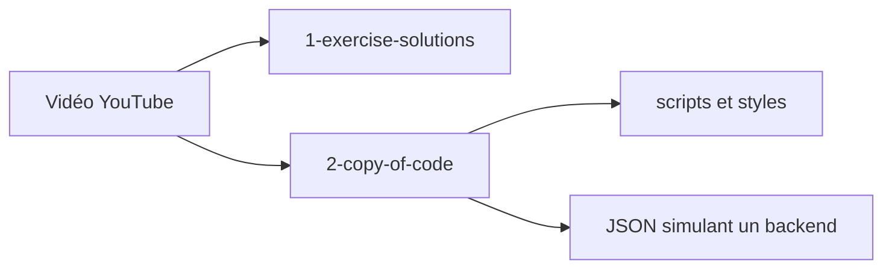

# SuperSimpleDev/javascript-course

> Solutions d'exercices et code de fin de leçon d'un cours vidéo JavaScript pour débutants.

## Le problème
Suivre un cours en vidéo sans corrigés ni code final oblige à retaper ou deviner les solutions.

## Ce que ce n'est pas seulement
Le README ne fait que trois lignes : lien vers la vidéo YouTube, deux dossiers (`1-exercise-solutions`, `2-copy-of-code`) et un certificat payant ou externe sur le site du cours.

## Ce que ça fait vraiment
Dépôt de HTML, CSS et JavaScript sans build, organisé par leçon. Les leçons 13 à 18 utilisent des fichiers JSON comme faux backend, et les leçons 16 à 18 des tests Jasmine, selon le code.

## Comment c'est branché

## Essayer
Aucune commande documentée dans le README.

## Coût et pièges
Gratuit. Aucune licence déclarée : copier le code hors apprentissage n'est pas autorisé explicitement. Dernier push le 2025-05-06.

## Ce que ce n'est pas
Ce n'est ni un cours écrit ni une bibliothèque : sans la vidéo, il y a peu de contexte.

## Alternatives
Aucune alternative nommée dans le README.

## Pour toi
Ignorer : support d'un cours JavaScript débutant, sans licence claire, sans intérêt pour un profil data ou MLOps.

