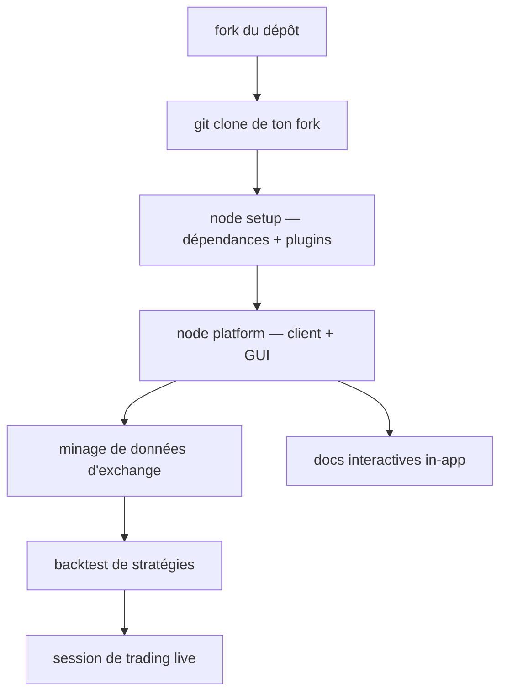

# Superalgos/Superalgos

> Plateforme communautaire de trading automatisé : minage de données, backtest et sessions live.

## Le problème
Construire une stratégie de trading demande d'agréger des données de marché, de les rejouer, puis de passer en live sans réécrire le tout.
Les plateformes existantes sont fermées et facturées.

## Ce que ça fait vraiment
Une application locale (client Node + GUI navigateur) qui mine les données d'exchange, backteste des stratégies et exécute des sessions de trading réel.
Des tutoriels interactifs intégrés guident l'apprentissage de l'interface, du minage, du backtest jusqu'à la session live ; le README insiste pour les faire tous.
La documentation interne compte plus de 1500 pages, interactive et cherchable dans l'app, plus à jour que la version web.
Le déploiement s'étend du PC au Raspberry Pi, au Docker et au cloud public, avec une option `minMemo` pour les machines à 8 Go ou moins.

## Comment c'est branché


## Essayer
```bash
git clone https://github.com/John/Superalgos
cd Superalgos
node setup
node platform
node platform minMemo
```

## Coût et pièges
Le fork n'est pas optionnel : les scripts d'installation construisent l'app depuis plusieurs dépôts, et il faut un jeton d'accès personnel GitHub avec les scopes `repo` et `workflow`.
Un compte d'exchange (Binance ou Binance US dans le tutoriel) est nécessaire pour la partie live ; sous 1 Go de RAM le README recommande de rester sur Node 16.

## Ce que ce n'est pas
Ce n'est pas un logiciel neutre : il est adossé à un token natif « SA » distribué aux contributeurs, et le fork sert aussi ce modèle.
Ce n'est pas testé partout — l'UI n'est validée que sur Chrome et Safari. L'intégration TensorFlow est décrite comme partielle et incomplète.
Le README consacre un encadré aux arnaques par usurpation dans ses groupes Telegram.

## Alternatives
Aucune alternative n'est nommée dans le README.

## Pour toi
Hors périmètre : projet à jeton, GUI lourde, ML embryonnaire — l'effort d'entrée n'est pas justifié par la partie data.
