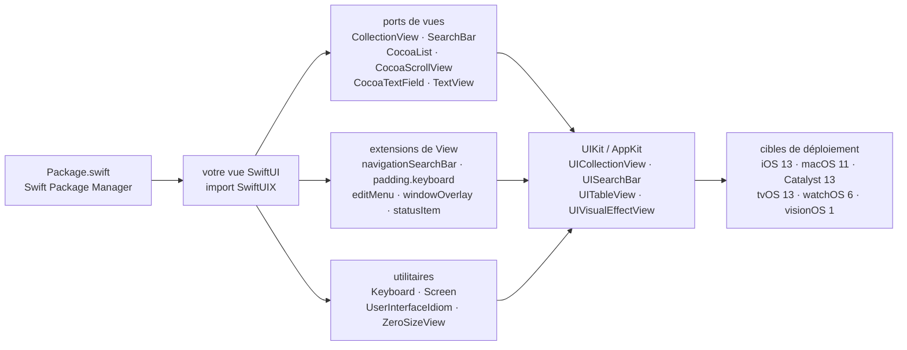

# SwiftUIX/SwiftUIX

> **A Swift package exposing UIKit/AppKit components that SwiftUI itself does not provide.**

## The problem

SwiftUI does not cover everything UIKit and AppKit could do: no collection view, no search bar,
no multiline text view, no blur effect view, no direct access to the screen or the keyboard.
Each gap is worked around by hand, wrapping the matching UIKit view in a `UIViewRepresentable`.
That bridging code gets rewritten in every project, each time with its own guesses about how it
should behave on the non-iOS platforms.

## What it actually does

SwiftUIX ships those bridges already written, as SwiftUI views and extensions. The README gives
an explicit mapping table: `UICollectionView` → `CollectionView`, `UISearchBar` → `SearchBar`,
`UITextField` → `CocoaTextField`, `UITableView` → `CocoaList`, `UIScrollView` → `CocoaScrollView`,
`UIActivityIndicatorView` → `ActivityIndicator`, `UIVisualEffectView` → `VisualEffectView`,
`UIPageViewController` → `PaginationView`, `UIWindow` → `WindowOverlay`,
`LPLinkView` → `LinkPresentationView`, and about a dozen more.

Alongside those ports, the README lists `View` extensions used as modifiers:
`navigationBarColor(_:)`, `navigationBarTranslucent(_:)`, `navigationBarTransparent(_:)`,
`navigationSearchBar(_:)`, `isScrollEnabled(_:)`, `padding(.keyboard)`, `visible(_:)`,
`editMenu(isVisible:content:)`, `windowOverlay(isKeyAndVisible:content:)`, `statusItem(id:image:)`,
`flip3D(_:axis:reverse:)`. Plus utility types: `Keyboard`, `Screen`, `UserInterfaceIdiom`,
`UserInterfaceOrientation`, `ZeroSizeView`, `RectangleCorner`, `TryButton` (a button whose action
may throw), `ScrollIndicatorStyle`.

The stated scope covers iOS 13, macOS 11, Mac Catalyst 13, tvOS 13, watchOS 6 and visionOS 1,
with CI verified on those six destinations. It is a library of views and modifiers: it
orchestrates nothing, it only adds itself to SwiftUI.

## How it is wired



No code-derived diagram exists for this repository: this one is reconstructed from the README
alone. There is no central piece — each component independently wraps its UIKit/AppKit
counterpart, and the only thing they all share is the `import SwiftUIX`.

## Trying it

Installation goes through the Swift Package Manager. In `Package.swift`:

```swift
/// Package.swift
/// ...
dependencies: [
    .package(url: "https://github.com/SwiftUIX/SwiftUIX.git", branch: "master"),
]
/// ...
```

From Xcode, the README gives the steps: **File** → **Swift Packages** →
**Add Package Dependency...**, paste `https://github.com/SwiftUIX/SwiftUIX`, pick **Branch** set
to `master`, then add **SwiftUIX.framework** to **Linked Frameworks and Libraries** with
**Status** set to **Optional**.

Typical usage, as given in the README:

```swift
import SwiftUIX

struct MyCollectionView: View {
    let data: [MyModel] // Your data source

    var body: some View {
        CollectionView(data, id: \.self) { item in
            // Build your cell view
            Text(item.title)
        }
    }
}
```

To work on the library itself, the README says to open `Package.swift` from the cloned repository
and to verify a local macOS build with:

```bash
xcodebuild -scheme SwiftUIX -destination 'generic/platform=macOS' build
```

## Cost and pitfalls

- **Apple ecosystem required**: Xcode 15.4 minimum, Swift 5.10 minimum (Swift 5.9 is no longer
  supported), therefore a Mac. None of this runs outside macOS.
- **Depends on a branch, not a release**: the README recommends `branch: "master"`. No tagged
  version appears in the installation instructions, so the dependency tracks ongoing development
  and an update can land without release notes.
- **Documentation in progress**: the README says so itself, the documentation is
  *work-in-progress*. The DocC site (`swiftuix.github.io`) and the repository wiki split what
  exists, and the README remains the most complete listing of components.
- **Very wide surface, uneven coverage**: dozens of components across six platforms. The README
  already flags one divergence — `isScrollEnabled(_:)` works on `CocoaList`, `CocoaScrollView`,
  `CollectionView` and `TextView`, but *not* on SwiftUI's own `ScrollView`. Such gaps are
  documented case by case only.
- **A single maintainer**: the README states the project is led and maintained by @vatsal_manot,
  with thanks to a few contributors. Funding goes through Patreon, and the Support section calls
  the maintenance massively time-consuming. That is the reason for the alert.
- **No financial cost**: MIT licence, announced as free and open source permanently. No API key,
  no third-party service, no quota.

## What it is not

- **It is not a replacement for SwiftUI.** The README says "complement": SwiftUIX adds to the
  standard library, it does not substitute for it. You keep writing SwiftUI, with a few extra
  views.
- **It is not cross-platform in the broad sense**: every target is an Apple platform. Nothing for
  Android, the web or Linux.
- **It is not a set of ready-made styled UI components**: these are technical ports of UIKit and
  AppKit APIs, not themed widgets, not a design system.
- **It is not conventionally versioned for its users**: the recommended installation pins a
  branch. Anyone needing a frozen dependency must pick a commit or a tag themselves, which the
  README does not cover.
- **It is not documented end to end**: some components appear in the README by name only, with no
  example and no documentation page.

## Alternatives

No comparable alternative in the catalogue. The README names no competing project, and the
lexically computed neighbours belong to the Swift ecosystem without playing the same role:
`SwifterSwift/SwifterSwift` extends Swift standard library and Foundation types, not SwiftUI;
`onevcat/Kingfisher` only handles image downloading and caching; `Juanpe/SkeletonView` only does
loading animations; `harflabs/SwiftVLC` is a video player wrapper. None of them ports missing
UIKit/AppKit components to SwiftUI.

## For you

Out of scope for a data / AI / MLOps profile: nothing here touches data, models or deployment,
and the entry cost is a Mac plus an Xcode toolchain. Worth watching only if an iOS or macOS app
ever joins the picture — it would then be the reasonable starting point to avoid rewriting
`UIViewRepresentable` bridges, provided you accept a branch dependency and a single maintainer.
Otherwise, move on.
