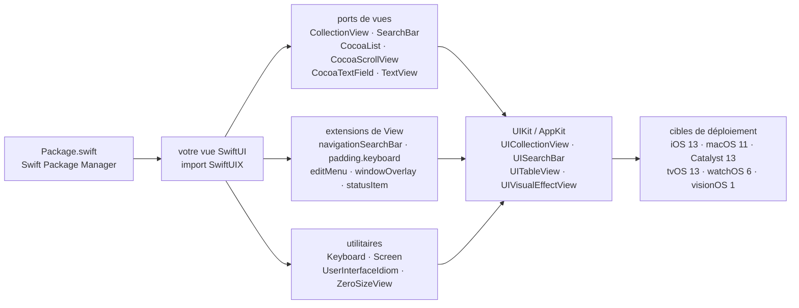

# SwiftUIX/SwiftUIX

> **Un paquet Swift qui rend en SwiftUI des composants UIKit/AppKit que SwiftUI ne fournit pas.**

## Le problème

SwiftUI ne couvre pas tout ce qu'UIKit et AppKit savaient faire : pas de vue de collection, pas
de barre de recherche, pas de champ de texte multiligne, pas de vue à effet de flou, pas d'accès
à l'écran ou au clavier. Chaque manque se contourne à la main en enveloppant la vue UIKit
correspondante dans un `UIViewRepresentable`, code de pont que chaque projet réécrit pour son
compte, avec ses propres approximations sur les plateformes non-iOS.

## Ce que ça fait vraiment

SwiftUIX fournit ces ponts déjà écrits, sous forme de vues et d'extensions SwiftUI. Le README
donne une table de correspondance explicite : `UICollectionView` → `CollectionView`,
`UISearchBar` → `SearchBar`, `UITextField` → `CocoaTextField`, `UITableView` → `CocoaList`,
`UIScrollView` → `CocoaScrollView`, `UIActivityIndicatorView` → `ActivityIndicator`,
`UIVisualEffectView` → `VisualEffectView`, `UIPageViewController` → `PaginationView`,
`UIWindow` → `WindowOverlay`, `LPLinkView` → `LinkPresentationView`, et une dizaine d'autres.

À côté de ces ports, le README liste des extensions de `View` qui s'appliquent en modificateurs :
`navigationBarColor(_:)`, `navigationBarTranslucent(_:)`, `navigationBarTransparent(_:)`,
`navigationSearchBar(_:)`, `isScrollEnabled(_:)`, `padding(.keyboard)`, `visible(_:)`,
`editMenu(isVisible:content:)`, `windowOverlay(isKeyAndVisible:content:)`, `statusItem(id:image:)`,
`flip3D(_:axis:reverse:)`. S'y ajoutent des types utilitaires : `Keyboard`, `Screen`,
`UserInterfaceIdiom`, `UserInterfaceOrientation`, `ZeroSizeView`, `RectangleCorner`, `TryButton`
(un bouton dont l'action peut lever une erreur), `ScrollIndicatorStyle`.

Le périmètre annoncé couvre iOS 13, macOS 11, Mac Catalyst 13, tvOS 13, watchOS 6 et visionOS 1,
avec une intégration continue vérifiée sur ces six destinations. C'est une bibliothèque de vues
et de modificateurs : elle n'orchestre rien, elle ne fait que s'ajouter à SwiftUI.

## Comment c'est branché



Aucun diagramme tiré du code n'existe pour ce dépôt : ce schéma est reconstruit depuis le seul
README. Il n'y a pas de pièce centrale — chaque composant enveloppe indépendamment son
équivalent UIKit/AppKit, et la seule chose que tous partagent est le `import SwiftUIX`.

## Essayer

L'installation passe par Swift Package Manager. Dans `Package.swift` :

```swift
/// Package.swift
/// ...
dependencies: [
    .package(url: "https://github.com/SwiftUIX/SwiftUIX.git", branch: "master"),
]
/// ...
```

Depuis Xcode, le README donne la procédure : **File** → **Swift Packages** →
**Add Package Dependency...**, coller `https://github.com/SwiftUIX/SwiftUIX`, choisir **Branch**
avec `master`, puis ajouter **SwiftUIX.framework** aux **Linked Frameworks and Libraries** avec
**Status** à **Optional**.

Usage typique donné par le README :

```swift
import SwiftUIX

struct MyCollectionView: View {
    let data: [MyModel] // Your data source

    var body: some View {
        CollectionView(data, id: \.self) { item in
            // Build your cell view
            Text(item.title)
        }
    }
}
```

Pour travailler sur la bibliothèque elle-même, le README indique d'ouvrir `Package.swift` depuis
le dépôt cloné, et de vérifier une compilation macOS locale avec :

```bash
xcodebuild -scheme SwiftUIX -destination 'generic/platform=macOS' build
```

## Coût et pièges

- **Écosystème Apple obligatoire** : Xcode 15.4 minimum, Swift 5.10 minimum (Swift 5.9 n'est plus
  supporté), donc un Mac. Rien de tout cela ne tourne hors macOS.
- **Dépendance sur une branche, pas sur une version** : le README recommande `branch: "master"`.
  Aucune version étiquetée n'est proposée dans les instructions d'installation — la dépendance
  suit donc le développement en cours, et une mise à jour peut arriver sans note de version.
- **Documentation en chantier** : le README le dit lui-même, la documentation est
  *work-in-progress*. Le site DocC (`swiftuix.github.io`) et le wiki du dépôt se partagent ce qui
  existe, et le README reste la liste la plus complète des composants.
- **Surface très large, couverture inégale** : des dizaines de composants pour six plateformes.
  Le README signale déjà un cas où le comportement diffère — `isScrollEnabled(_:)` fonctionne sur
  `CocoaList`, `CocoaScrollView`, `CollectionView` et `TextView`, mais *pas* sur le `ScrollView`
  de SwiftUI. Ce genre d'écart n'est documenté qu'au cas par cas.
- **Un seul mainteneur** : le README indique que le projet est « led and maintained by »
  @vatsal_manot, avec des remerciements à quelques contributeurs. Le financement passe par
  Patreon, et la section Support qualifie la maintenance d'« massively time-consuming ». C'est la
  raison de l'alerte.
- **Coût financier nul** : licence MIT, projet annoncé comme gratuit et open source de façon
  permanente. Pas de clé d'API, pas de service tiers, pas de quota.

## Ce que ce n'est pas

- **Ce n'est pas un remplacement de SwiftUI.** Le README dit « complement » : SwiftUIX s'ajoute à
  la bibliothèque standard, il ne s'y substitue pas. On continue d'écrire du SwiftUI, avec
  quelques vues en plus.
- **Ce n'est pas une bibliothèque multiplateforme au sens large** : les cibles sont toutes des
  plateformes Apple. Rien pour Android, le web ou Linux.
- **Ce n'est pas un ensemble de composants d'interface prêts à l'emploi au sens d'un thème** :
  ce sont des ports techniques d'API UIKit/AppKit, pas des composants stylisés, pas un système
  de design.
- **Ce n'est pas un projet versionné de façon conventionnelle pour ses utilisateurs** :
  l'installation recommandée épingle une branche. Qui a besoin d'une dépendance figée devra
  choisir lui-même un commit ou une étiquette, ce que le README ne traite pas.
- **Ce n'est pas documenté de bout en bout** : une partie des composants n'est listée dans le
  README que par son nom, sans exemple ni page de documentation.

## Alternatives

Aucune alternative comparable dans le catalogue. Le README ne nomme aucun projet concurrent, et
les voisins proposés par le lexique appartiennent à l'écosystème Swift sans jouer le même rôle :
`SwifterSwift/SwifterSwift` étend les types de la bibliothèque standard Swift et de Foundation,
pas SwiftUI ; `onevcat/Kingfisher` ne traite que le téléchargement et le cache d'images ;
`Juanpe/SkeletonView` ne fait que des animations de chargement ; `harflabs/SwiftVLC` est un
habillage de lecteur vidéo. Aucun ne porte des composants UIKit/AppKit manquants vers SwiftUI.

## Pour toi

Hors périmètre pour un profil data / IA / MLOps : rien ici ne touche aux données, aux modèles ni
à l'industrialisation, et l'entrée demande un Mac et une chaîne Xcode. À surveiller seulement si
une application iOS ou macOS s'ajoute un jour au tableau — ce serait alors le point d'entrée
raisonnable pour éviter de réécrire des ponts `UIViewRepresentable`, à condition d'accepter une
dépendance sur une branche et un mainteneur unique. Sinon, passer son chemin.
