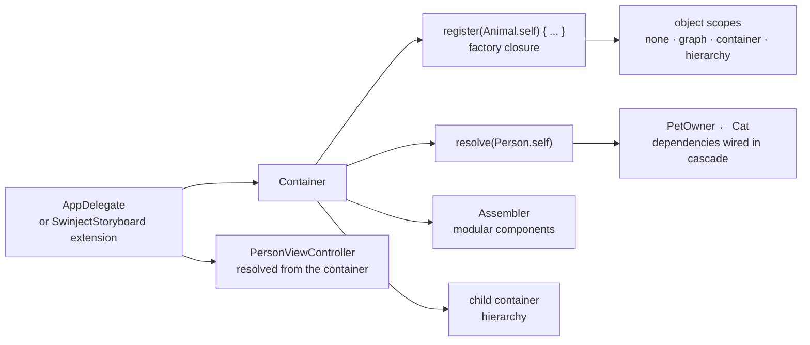

# Swinject/Swinject

> **A dependency injection container for Swift code, aimed at Apple-platform applications.**

## The problem

Without a container, a Swift app wires its dependencies by hand: every screen builds its own
services, concrete types leak into initializers, and swapping a service for a test double
means editing the calling code. Circular dependencies and object lifetimes (transient, shared,
singleton) end up handled case by case.

## What it actually does

Swinject provides a `Container` where you register a protocol / implementation pair as a
factory closure: `container.register(Animal.self) { _ in Cat(name: "Mimi") }`. You then ask for
an instance by type, `container.resolve(Person.self)`, and intermediate dependencies are wired
in cascade through the resolver handed to the closure.

The README lists initializer, property and method injection, injection with arguments, an
initialization callback, circular dependency support, value types as well as reference types,
self-registration, container hierarchy and thread safety. Four object scopes are named: none
(transient), graph, container (singleton) and hierarchy. An `Assembler` splits registration
into modular components.

Everything else lives in separate repositories: loading property values from resources
(`SwinjectPropertyLoader`), Storyboard-driven injection (`SwinjectStoryboard`), code generation
from a CSV/YAML file (`Swinject-CodeGen`), and generics-based automatic registration
(`SwinjectAutoregistration`). The repo ships a `Sample-iOS.playground`.

## How it is wired

No code-derived diagram exists for this repository: the graph below is rebuilt from the README
alone, using the type names it mentions.



## Trying it

```bash
# Carthage — after adding `github "Swinject/Swinject"` to the Cartfile
carthage update --no-use-binaries

# CocoaPods — after adding `pod 'Swinject'` to the Podfile
pod install
```

For Swift Package Manager the README gives no command, only the entry to add to
`Package.swift`: `.package(url: "https://github.com/Swinject/Swinject.git", from: "2.8.0")`.
For the playground: build the project first, then pick `Editor > Execute Playground` in Xcode.

## Cost and gotchas

- **Free, MIT licensed**, no API key, no third-party service, no account to create.
- **The real prerequisite is Apple tooling**: the README requires Xcode 14.3+, Swift 4.2+ and
  iOS 11 / macOS 10.13 / watchOS 4 / tvOS 11 as a floor. A badge mentions Linux, but nothing
  in the README describes that path.
- **Carthage 0.18+ or CocoaPods 1.1.1+** depending on the install route.
- **Features are spread across repos**: Storyboard support, property loading, autoregistration
  and code generation are separate projects to track and update on their own.
- The Swift badge stops at 5.4 and the newest version quoted for SPM is 2.8.0: the README
  documents nothing more recent. That is the basis for the staleness flag.

## What it is not

- **Not an application framework**: no routing, no networking layer, no screen lifecycle.
  Swinject registers and resolves objects, nothing more.
- **Not automatic injection**: every service must be registered by hand before use, and the
  README places that registration in the `AppDelegate` or in a `SwinjectStoryboard` extension.
- **Resolution is not compile-time checked**: `resolve` returns an optional, and every README
  example force-unwraps it with `!`. A forgotten registration fails at runtime, not at build.

## Alternatives

No comparable alternative in the catalogue: the supplied neighbours (`ReactiveX/RxSwift`,
`onevcat/Kingfisher`, `SwifterSwift/SwifterSwift`, `Juanpe/SkeletonView`) are Swift projects,
but none does dependency injection — reactive programming, image caching, utility extensions,
loading skeletons. The only kinship the README claims is Ninject, Autofac and Funq, .NET
containers it draws inspiration from rather than substitutes for a Swift project.

## For you

Skip it as a data / AI / MLOps profile: this is a dependency injection container for Apple
applications, unrelated to data, training or model deployment. Worth knowing only if an iOS
side project lands in your scope.
