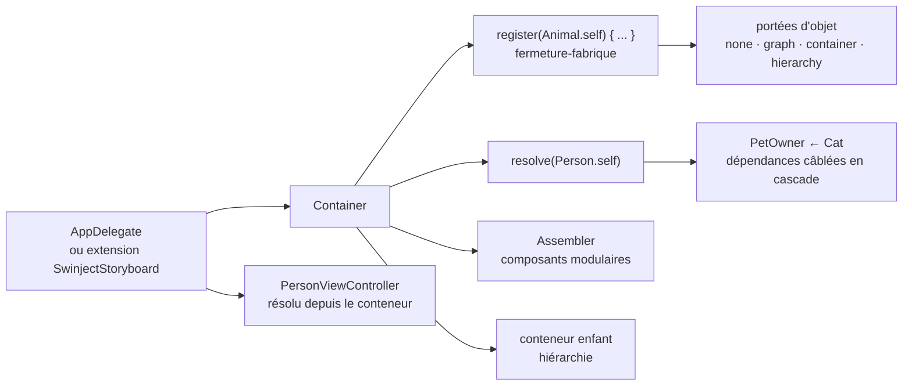

# Swinject/Swinject

> **Conteneur d'injection de dépendances pour du code Swift, côté application Apple.**

## Le problème

Sans conteneur, une application Swift câble ses dépendances à la main : chaque écran
instancie ses services, les types concrets remontent dans les initialiseurs, et remplacer un
service par un double de test oblige à toucher au code appelant. Les cycles de dépendances et
la durée de vie des objets (transitoire, partagé, singleton) se gèrent alors au cas par cas.

## Ce que ça fait vraiment

Swinject fournit un objet `Container` où l'on enregistre une paire protocole / implémentation
sous forme de fermeture-fabrique : `container.register(Animal.self) { _ in Cat(name: "Mimi") }`.
La résolution se fait ensuite par le type demandé, `container.resolve(Person.self)`, et les
dépendances intermédiaires sont câblées en cascade par le résolveur passé à la fermeture.

Le README annonce l'injection par initialiseur, par propriété et par méthode, l'injection avec
arguments, une fonction de rappel d'initialisation, la prise en charge des dépendances
circulaires, les types valeur autant que référence, l'auto-enregistrement, la hiérarchie de
conteneurs et la sûreté vis-à-vis des fils d'exécution. Quatre portées d'objet sont listées :
aucune (transitoire), graphe, conteneur (singleton) et hiérarchie. Un `Assembler` permet de
découper l'enregistrement en composants modulaires.

Le reste est renvoyé à des dépôts séparés : chargement de propriétés depuis des ressources
(`SwinjectPropertyLoader`), injection via Storyboard (`SwinjectStoryboard`), génération de code
depuis un CSV/YAML (`Swinject-CodeGen`), enregistrement automatique par génériques
(`SwinjectAutoregistration`). Le dépôt embarque un terrain de jeu `Sample-iOS.playground`.

## Comment c'est branché

Aucun diagramme tiré du code n'existe pour ce dépôt : ce schéma est reconstruit depuis le seul
README, avec les noms de types qu'il cite.



## Essayer

```bash
# Carthage — après avoir ajouté `github "Swinject/Swinject"` au Cartfile
carthage update --no-use-binaries

# CocoaPods — après avoir ajouté `pod 'Swinject'` au Podfile
pod install
```

Pour Swift Package Manager, le README ne donne pas de commande mais l'entrée à ajouter dans
`Package.swift` : `.package(url: "https://github.com/Swinject/Swinject.git", from: "2.8.0")`.
Pour le terrain de jeu : construire le projet, puis menu `Editor > Execute Playground` dans
Xcode.

## Coût et pièges

- **Gratuit, licence MIT**, aucune clé d'API, aucun service tiers, aucun compte à créer.
- **Le vrai prérequis est l'outillage Apple** : le README exige Xcode 14.3+, Swift 4.2+ et
  iOS 11 / macOS 10.13 / watchOS 4 / tvOS 11 au minimum. Le badge de plateformes mentionne
  Linux, mais rien dans le README ne décrit cette voie.
- **Carthage 0.18+ ou CocoaPods 1.1.1+** selon la voie d'installation choisie.
- **Fonctionnalités éclatées** : Storyboard, chargement de propriétés, auto-enregistrement et
  génération de code sont des dépôts distincts, à suivre et à mettre à jour séparément.
- Le badge de version Swift affiché s'arrête à 5.4 et la dernière version citée pour SPM est
  2.8.0 : le README ne documente rien de plus récent. C'est la base de l'alerte.

## Ce que ce n'est pas

- **Ce n'est pas un cadre applicatif** : pas de routage, pas de couche réseau, pas de cycle de
  vie d'écran. Swinject enregistre et résout des objets, rien d'autre.
- **Ce n'est pas de l'injection automatique** : tout service doit être enregistré à la main
  avant usage, et le README rappelle que l'enregistrement se fait dans l'`AppDelegate` ou dans
  une extension de `SwinjectStoryboard`.
- **La résolution n'est pas vérifiée à la compilation** : `resolve` renvoie un optionnel, et
  tous les exemples du README le déballent par `!`. Un enregistrement oublié tombe à
  l'exécution, pas au build.

## Alternatives

Aucune alternative comparable dans le catalogue : les voisins fournis (`ReactiveX/RxSwift`,
`onevcat/Kingfisher`, `SwifterSwift/SwifterSwift`, `Juanpe/SkeletonView`) sont bien du Swift,
mais aucun ne fait de l'injection de dépendances — programmation réactive, cache d'images,
extensions utilitaires, écrans de chargement. Le README ne cite comme parenté que Ninject,
Autofac et Funq, qui sont des conteneurs .NET dont Swinject s'inspire, pas des remplaçants
pour un projet Swift.

## Pour toi

À ignorer pour un profil data / IA / MLOps : c'est un conteneur d'injection de dépendances
pour applications Apple, sans rapport avec les données, l'entraînement ou le déploiement de
modèles. Utile seulement si un projet iOS annexe entre dans ton périmètre.
