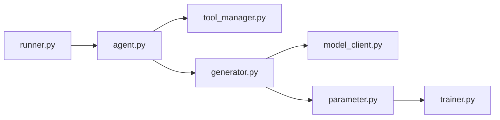

# SylphAI-Inc/AdalFlow

> Bibliothèque de type PyTorch pour construire des workflows LLM (chatbot, RAG, agents) et optimiser leurs prompts.

## Le problème
Écrire et régler à la main des prompts pour chaque modèle est long et fragile.

## Ce que ça fait vraiment
Propose des composants indépendants du fournisseur (`Generator`, `Component`, `Agent`, `Runner`) et un cadre d'optimisation où les prompts sont des `Parameter` entraînés par gradients textuels et démonstrations few-shot, avec `Trainer`. Le `Runner` exécute l'agent en mode synchrone, asynchrone ou en flux ; traçage et validation humaine sont mentionnés. Le README compare avec DSPy, Agent Lightning et TextGrad.

## Comment c'est branché


## Essayer
```bash
pip install adalflow
```
Puis définir `OPENAI_API_KEY` et exécuter l'exemple d'agent du README (`Agent`, `Runner`, `runner.call(...)`).

## Coût et pièges
Les appels aux modèles sont à ta charge. Les exemples du README utilisent `eval` dans un outil calculatrice : ne pas le reprendre tel quel en production. Dernier push le 2026-05-29.

## Ce que ce n'est pas
Pas une garantie contre DSPy : les comparaisons du README viennent des auteurs.

## Alternatives
- DSPy : programmation déclarative, compilateur de prompts.
- TextGrad : descente de gradient textuelle.
- Agent Lightning : entraîne n'importe quel agent (LangChain, AutoGen…).

## Pour toi
À surveiller : sérieux candidat si l'optimisation automatique de prompts est ton besoin, à comparer à DSPy sur ta propre tâche avant d'adopter.

