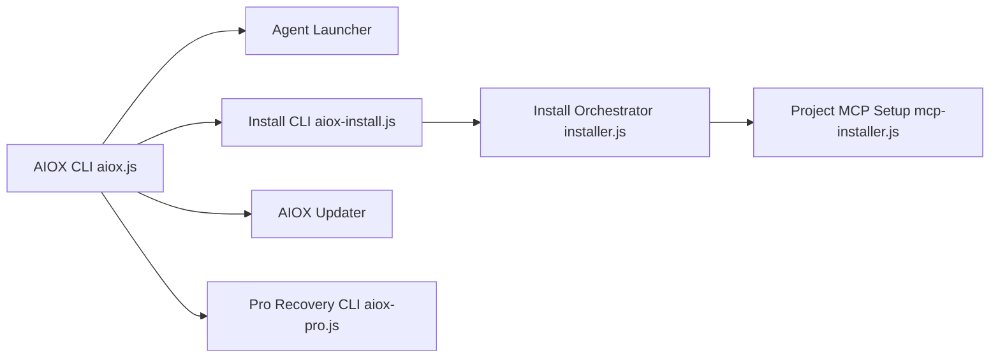

# SynkraAI/aios-core

> Framework CLI qui installe dans un projet des agents IA spécialisés (analyste, PM, dev, QA) pilotés depuis ton IDE.

## Le problème
Le développement assisté par IA perd le contexte entre planification et code : les tâches générées sont génériques et incohérentes d'un agent à l'autre.

## Ce que ça fait vraiment
Installe via `npx` des agents (12 annoncés) et workflows dans un projet existant ou neuf. Deux phases : agents de planification produisant PRD et architecture, puis agent Scrum Master qui écrit des « stories » détaillées que dev et QA consomment. Intégrations décrites pour Claude Code, Gemini CLI, Codex CLI, Cursor, Copilot, avec une parité de hooks très inégale. Un module payant AIOX Pro est réservé à une cohorte.

## Comment c'est branché


## Essayer
```bash
npx aiox-core init meu-projeto
cd seu-projeto
npx aiox-core install
npx aiox-core doctor
```

## Coût et pièges
Le framework est libre mais il repose sur un assistant IA à ta charge (abonnement ou clé d'API). AIOX Pro (licence, machineId) est réservé aux membres d'une formation payante.

## Ce que ce n'est pas
Pas un simple exécuteur de tâches, mais pas non plus un produit autonome : sans IDE compatible, l'automatisation est réduite. Le README est en portugais et la documentation référencée n'est pas incluse. Le nom du paquet npm est en cours de migration vers `@aiox-squads/core`.

## Alternatives
Aucune alternative nommée dans le README (il se compare seulement à « taskmaster » pour dire qu'il n'en est pas un).

## Pour toi
À surveiller : la méthode planification → stories est transposable à tes projets, mais l'outil est couplé à des conventions maison, avec une licence à vérifier et une partie premium fermée.
