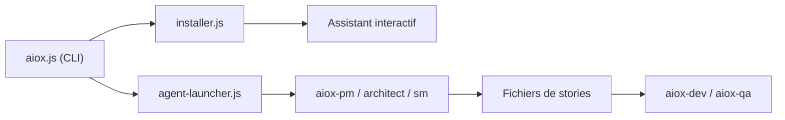

# SynkraAI/aiox-core

> Framework en ligne de commande qui orchestre des agents spécialisés (PM, architecte, dev, QA) pour développer.

## Le problème
Les agents de code perdent le contexte entre planification et implémentation, et produisent des tâches génériques.

## Ce que ça fait vraiment
Installeur `npx aiox-core` qui déploie 12 agents et des workflows dans un projet. Deux phases : agents de planification (PRD, architecture) puis Scrum Master qui écrit des « stories » détaillées consommées par dev et QA. Un moteur autonome (ADE) ajoute worktrees git, pipeline de spec, reprise sur échec et couche mémoire. Intégrations IDE inégales : hooks complets seulement sous Claude Code. README principalement en portugais.

## Comment c'est branché


## Essayer
```bash
npx aiox-core init meu-projeto
cd seu-projeto && npx aiox-core install
npx aiox-core doctor
```

## Coût et pièges
Cœur gratuit ; le module AIOX Pro est réservé aux membres d'un programme payant (« Cohort Advanced »), avec licence par machine. La licence du dépôt n'est pas identifiée par GitHub (le README évoque MIT) : à vérifier. Le nouveau paquet `@aiox-squads/core` succède au nom actuel.

## Ce que ce n'est pas
Ce n'est pas un simple exécuteur de tâches : il impose un processus agile complet. Les fonctions avancées dépendent des hooks, absents de Cursor et Copilot.

## Alternatives
Non documenté dans le README.

## Pour toi
Ignorer : cadre lourd et directif orienté développement logiciel, avec licence à clarifier et une partie payante derrière une cohorte.
