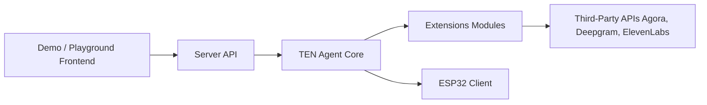

# TEN-framework/TEN-Agent

> Framework open source pour agents conversationnels multimodaux en temps réel, voix surtout.

## Le problème
Construire un assistant vocal à faible latence demande d'assembler transport temps réel, STT, LLM, TTS et détection de tour de parole.

## Ce que ça fait vraiment
Un cœur en Go charge des extensions (ASR, LLM, TTS) configurées par manifest et property.json ; un serveur expose les API et deux frontends Next.js. Exemples fournis : assistant vocal (RTC ou WebSocket), diarisation, avatars, appel SIP, transcription, carte ESP32. Un designer web (TMAN) règle les clés.

## Comment c'est branché


## Essayer
```bash
cd ai_agents
cp ./.env.example ./.env
docker compose up -d
docker exec -it ten_agent_dev bash
cd agents/examples/voice-assistant
task install
task run
```

## Coût et pièges
Le démarrage rapide exige Agora (App ID et certificat), OpenAI, Deepgram et ElevenLabs. Build de 5 à 8 minutes. Trois comptes tiers minimum.

## Ce que ce n'est pas
Pas une alternative locale : la chaîne par défaut dépend de services cloud payants.

## Alternatives
- Aucune alternative nommée dans le README.

## Pour toi
À surveiller : utile seulement si tu construis de la voix temps réel ; le coût en comptes tiers est élevé pour un simple essai.
