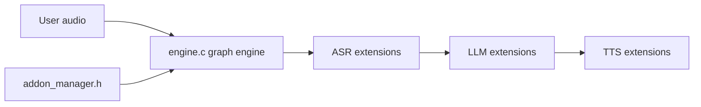

# TEN-framework/ten-framework

> Framework open source pour agents conversationnels multimodaux temps réel (voix, avatars, SIP).

## Le problème
Un assistant vocal temps réel exige de chaîner reconnaissance, LLM et synthèse avec une faible latence.

## Ce que ça fait vraiment
Un runtime compose des extensions (STT, LLM, TTS, outils) en graphes. Les exemples couvrent assistant vocal (RTC ou WebSocket), transcription, diarisation, avatars à synchronisation labiale, appels SIP, carte ESP32-S3. L'écosystème inclut TEN VAD et TEN Turn Detection.

## Comment c'est branché


## Essayer
```bash
cd ai_agents
cp ./.env.example ./.env
docker compose up -d
docker exec -it ten_agent_dev bash
cd agents/examples/voice-assistant
task install
task run
```

## Coût et pièges
Clés Agora (App ID et certificat), OpenAI, Deepgram et ElevenLabs pour l'exemple. Docker, Node 18, 2 cœurs et 4 Go de RAM minimum. Première build de 5 à 8 min. Licence non identifiée.

## Ce que ce n'est pas
Ce n'est pas un LLM : il orchestre des services tiers payants. Le README ne détaille pas le modèle de licence.

## Alternatives
Non documenté : le README ne nomme pas d'alternative.

## Pour toi
Surveiller : utile pour prototyper un agent vocal temps réel, mais cumule plusieurs services payants et une licence à vérifier.

