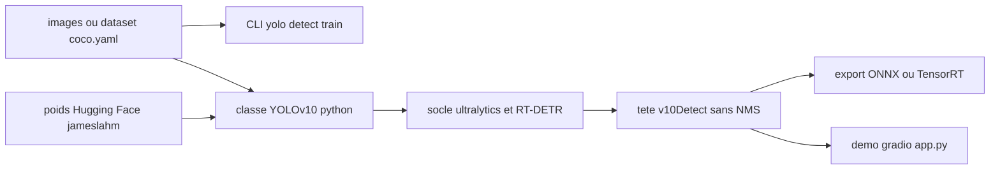

# THU-MIG/yolov10

> **Real-time NMS-free object detector, released with weights, for edge and latency-bound vision.**

## The problem

Classic YOLO models depend on non-maximum suppression after the network. The README makes this
the starting point: NMS adds latency and blocks end-to-end deployment. Without YOLOv10 you carry
a separate post-processing step and the component redundancy the authors describe.

## What it actually does

This is the official PyTorch implementation of the YOLOv10 paper (NeurIPS 2024), not a general
toolkit. It contributes consistent dual assignments, which make NMS-free training work, plus a
redesign of the network components to cut computation. Six model sizes are published, from N
(2.3M params, 38.5% AP on COCO, 1.84 ms) to X (29.5M, 54.4% AP, 10.70 ms), with weights on the
Hugging Face Hub. Training, validation, prediction and export all come from the `ultralytics`
code base, which the README names as its foundation together with RT-DETR.

## How it is wired



The README documents two equivalent entry points: the `yolo` CLI inherited from ultralytics, and
the Python `YOLOv10` class, loaded either from the Hub (`from_pretrained`) or from a `.pt` file
pulled from the repository releases. Both reach the same ultralytics core; what belongs to this
repository is the `v10Detect` head, named in the notes. A note dated 2024/05/31 warns that speed
is only measured fairly in the exported format, because the `cv2` and `cv3` operations of
`v10Detect` still run under PyTorch. A `push_to_hub` helper republishes a fine-tuned model.

## Trying it

```bash
conda create -n yolov10 python=3.9
conda activate yolov10
pip install -r requirements.txt
pip install -e .
```

```bash
python app.py
# Please visit http://127.0.0.1:7860
```

```bash
yolo detect train data=coco.yaml model=yolov10n/s/m/b/l/x.yaml epochs=500 batch=256 imgsz=640 device=0,1,2,3,4,5,6,7
yolo val model=jameslahm/yolov10{n/s/m/b/l/x} data=coco.yaml batch=256
yolo predict model=jameslahm/yolov10{n/s/m/b/l/x}
yolo export model=jameslahm/yolov10{n/s/m/b/l/x} format=onnx opset=13 simplify
```

## Cost and traps

Nothing to pay and no API key: the weights are public on the Hub. The cost sits elsewhere. First
the licence, AGPL-3.0, strong copyleft, which the README never mentions although it decides
whether the model can ship in a product. Then the hardware: the sample training command targets
`device=0,1,2,3,4,5,6,7`, that is eight GPUs, over 500 epochs at batch 256 — not a workstation
figure. Finally the measurement trap the authors themselves document: comparing latency in the
PyTorch format is biased, you have to export to ONNX or TensorRT. Installation pins Python 3.9
and uses `pip install -e .`, so a cloned source tree rather than a published package.

## What it is not

It is not a vision framework: almost all the tooling comes from ultralytics, and the repository
only adds the architecture and the weights. It is not an open-vocabulary detector either: it stays
closed over a predefined class set, and the README opens with a banner pointing to YOLOE, the
successor project from the same team, which says where the effort now goes. The published numbers
are measured on COCO at 640 px; for small or distant objects the authors point to a GitHub issue
rather than to documentation.

## Alternatives

- `ultralytics/ultralytics`: the base this repository derives from — pick it for maintained tooling
  and several model generations instead of one frozen architecture.
- `lyuwenyu/RT-DETR`: named as the second code base, a transformer approach already free of NMS,
  worth a look if a heavier model is acceptable.
- `roboflow/supervision` (catalogue neighbour): complementary rather than competing, it provides
  tracking, counting and annotation around a detector like this one.

## For you

Worth it if you build an embedded or real-time detection component where latency matters: the
weights exist and ONNX/TensorRT export is documented. But AGPL-3.0 and the team's visible shift to
YOLOE make it a repository to watch rather than to ship without a legal call first.
