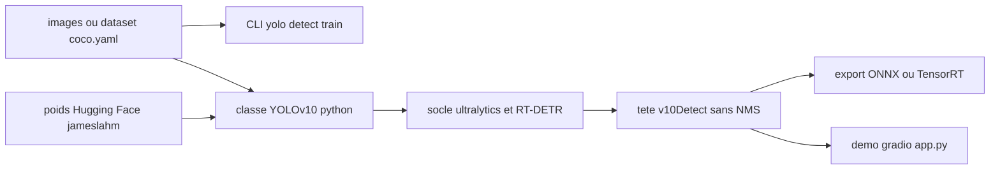

# THU-MIG/yolov10

> **Détecteur d'objets temps réel sans NMS, publié avec ses poids, pour la vision embarquée.**

## Le problème

Les YOLO classiques dépendent d'une étape de suppression non-maximale après le réseau : elle
ajoute de la latence et empêche un déploiement bout-en-bout, ce que le README pose comme le
point de départ du travail. Il faut donc, sans YOLOv10, traîner un post-traitement séparé et
accepter la redondance de calcul que les auteurs décrivent dans les composants existants.

## Ce que ça fait vraiment

C'est l'implémentation PyTorch officielle de l'article YOLOv10 (NeurIPS 2024), pas une boîte
à outils généraliste. Elle apporte deux choses : l'entraînement à double assignation
cohérente, qui rend le modèle utilisable sans NMS, et une révision des composants du réseau
pour réduire le coût de calcul. Six tailles de modèle sont publiées, de N (2,3 M paramètres,
38,5 % AP sur COCO, 1,84 ms) à X (29,5 M, 54,4 % AP, 10,70 ms), avec des poids sur le Hugging
Face Hub. Le reste — entraînement, validation, prédiction, export — est repris de la base de
code `ultralytics`, que le README cite explicitement comme socle avec RT-DETR.

## Comment c'est branché



Le README décrit deux portes d'entrée équivalentes : la commande `yolo` héritée
d'ultralytics et la classe Python `YOLOv10`, chargée soit depuis le Hub (`from_pretrained`)
soit depuis un `.pt` téléchargé sur les releases du dépôt. Les deux mènent au même socle
ultralytics ; la partie propre au dépôt est la tête `v10Detect`, que les notes mentionnent
nommément. Une remarque du 31/05/2024 précise que la mesure de vitesse n'est fiable qu'au
format exporté, les opérations `cv2` et `cv3` de `v10Detect` étant encore exécutées en
PyTorch. Un `push_to_hub` est prévu pour republier un modèle fine-tuné.

## Essayer

```bash
conda create -n yolov10 python=3.9
conda activate yolov10
pip install -r requirements.txt
pip install -e .
```

```bash
python app.py
# Please visit http://127.0.0.1:7860
```

```bash
yolo detect train data=coco.yaml model=yolov10n/s/m/b/l/x.yaml epochs=500 batch=256 imgsz=640 device=0,1,2,3,4,5,6,7
yolo val model=jameslahm/yolov10{n/s/m/b/l/x} data=coco.yaml batch=256
yolo predict model=jameslahm/yolov10{n/s/m/b/l/x}
yolo export model=jameslahm/yolov10{n/s/m/b/l/x} format=onnx opset=13 simplify
```

## Coût et pièges

Rien à payer et aucune clé d'API : les poids sont publics sur le Hub. Le coût est ailleurs.
D'abord la licence : AGPL-3.0, copyleft fort, ce que le README ne mentionne nulle part alors
que c'est déterminant pour un usage produit. Ensuite le matériel : la commande d'entraînement
donnée en exemple vise `device=0,1,2,3,4,5,6,7`, soit huit GPU, sur 500 époques et batch 256 —
ce n'est pas un ordre de grandeur de poste de travail. Enfin le piège de mesure documenté par
les auteurs : comparer les latences au format PyTorch donne des chiffres biaisés, il faut
passer par l'export ONNX ou TensorRT. L'installation impose Python 3.9 et un `pip install -e .`,
donc une source clonée, pas un paquet publié.

## Ce que ce n'est pas

Ce n'est pas un framework de vision : presque tout l'outillage vient d'ultralytics, le dépôt
n'apporte que l'architecture et les poids. Ce n'est pas non plus un détecteur open-vocabulary :
il reste fermé sur un jeu de classes prédéfini, et le README ouvre d'ailleurs sur une bannière
renvoyant vers YOLOE, le projet successeur de la même équipe, ce qui en dit long sur l'endroit
où va l'effort. Enfin, les chiffres annoncés sont mesurés sur COCO à 640 px : ils ne préjugent
pas du comportement sur de petits objets, sujet pour lequel les auteurs renvoient à une issue
plutôt qu'à de la documentation.

## Alternatives

- `ultralytics/ultralytics` : le socle dont ce dépôt dérive — à préférer si on veut un outillage
  maintenu et plusieurs générations de modèles plutôt qu'une architecture figée.
- `lyuwenyu/RT-DETR` : cité comme seconde base de code, approche transformer déjà sans NMS, à
  regarder si on accepte un modèle plus lourd.
- `roboflow/supervision` (voisin du catalogue) : complémentaire plutôt que concurrent, il
  fournit le suivi, le comptage et l'annotation autour d'un détecteur comme celui-ci.

## Pour toi

Intéressant si tu construis une brique de détection embarquée ou temps réel et que la latence
compte : les poids sont là, l'export ONNX/TensorRT est documenté. Mais l'AGPL-3.0 et la
bascule visible de l'équipe vers YOLOE en font un dépôt à surveiller plutôt qu'à mettre en
production sans arbitrage juridique.
