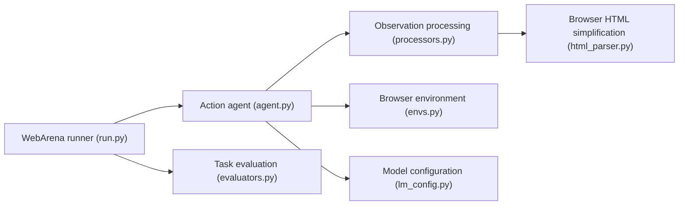

# THUDM/AutoWebGLM

> Implémentation officielle d'un agent de navigation web piloté par ChatGLM3-6B, avec banc d'essai bilingue.

## Le problème
Les agents de navigation web gèrent mal des pages HTML longues et complexes en conditions réelles.

## Ce que ça fait vraiment
Dépôt d'évaluation : exécuteurs WebArena et MiniWob++ qui construisent un prompt à partir de l'état du navigateur, génèrent et parsent une action, l'appliquent, puis évaluent la trajectoire. Contient l'algorithme de simplification du HTML. Le README décrit aussi un entraînement hybride humain-IA, de l'apprentissage par renforcement et le banc AutoWebBench, mais le dépôt n'expose pas le pipeline d'entraînement.

## Comment c'est branché


## Essayer
```bash
python eval.py [result_path]
```
L'inférence renvoie vers ChatGLM3-6B ; les environnements WebArena et MiniWob++ ont leurs propres README.

## Coût et pièges
Gratuit, mais il faut un GPU pour ChatGLM3-6B et des environnements modifiés (WebArena, MiniWob++). Le dernier push date de septembre 2024.

## Ce que ce n'est pas
Ce n'est pas un agent prêt à l'emploi : c'est le code d'évaluation d'un article de recherche. Le pipeline d'entraînement annoncé n'est pas dans le dépôt.

## Alternatives
Aucune alternative nommée dans le README.

## Pour toi
À ignorer : dépôt de recherche figé depuis 2024, lisible pour l'algorithme de simplification HTML mais sans chemin d'usage directement exploitable.

