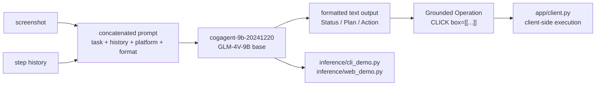

# THUDM/CogAgent

> **A 9B vision-language model that reads a screenshot and returns the GUI action to perform.**

## The problem

Automating a graphical interface with no API means first locating the element to click inside
a screenshot, then deciding the operation. General chat models do not return usable
coordinates, and the usual workaround is bolting an external grounding model onto an LLM.

## What it actually does

`cogagent-9b-20241220` takes a screenshot, a task description, the platform (`WIN`, `Mac`,
`Mobile`) and the history of already executed steps, and returns a string in a strict format.
Depending on the requested `format_key`, the answer carries `Status`, `Plan`, `Action` and
`Grounded Operation` fields plus a sensitivity marker `<<敏感操作>>` / `<<一般操作>>`. The
operation looks like `CLICK(box=[[...]], element_info=...)`, `TYPE(...)` or `SCROLL_DOWN(...)`;
the action space is documented in `Action_space.md`. The model is bilingual Chinese/English
and is built on GLM-4V-9B. It executes nothing itself: it predicts the action, and the calling
code performs the click.

## How it is wired



The README points to `app/client.py#L115` for prompt construction, `inference/cli_demo.py` and
`inference/web_demo.py` for inference, `finetune/README.md` for fine-tuning and
`app/README.md` for the demo application.

## Trying it

```shell
pip install -r requirements.txt
```

```shell
python inference/cli_demo.py --model_dir THUDM/cogagent-9b-20241220 --platform "Mac" --max_length 4096 --top_k 1 --output_image_path ./results --format_key status_action_op_sensitive
```

```shell
python inference/web_demo.py --host 0.0.0.0 --port 7860 --model_dir THUDM/cogagent-9b-20241220 --format_key status_action_op_sensitive --platform "Mac" --output_dir ./results
```

Python 3.10.16 or above is required.

## Cost and gotchas

The README states at least 29GB of VRAM for `BF16` inference; roughly 15GB for `INT8` and 8GB
for `INT4`, the latter discouraged because of the performance loss and supported on NVIDIA
devices only. SFT freezes the `Vision Encoder`, runs on `8 * A100` and needs at least 60GB per
GPU; LoRA needs at least 70GB on a single GPU and cannot be split. The online demos do not
control a computer, they only show inference results. Code is Apache 2.0, while the weights
fall under a separate `MODEL_LICENSE` whose terms the README does not spell out.

## What it is not

It is not a conversational model: no continuous dialogue, only an execution history you must
re-supply each turn. It is not a full agent driving your machine either — the repository ships
the model and demos, actually performing the clicks is on you, and the README warns it cannot
guarantee the safety of the AI's behaviour. Output is a string in the imposed format, not
JSON, and an image input is mandatory.

## Alternatives

The README compares against Qwen2-VL, ShowUI and SeeClick (open-source GUI models), GPT-4o
combined with UGround or OS-ATLAS, and Claude-3.5-Sonnet on the commercial API side, and
points to THUDM/CogVLM for the first CogAgent generation. Among the catalogue neighbours there
is no comparable alternative: google/adk-samples, asterdex/api-docs, githubnext/gh-aw and
steveyegge/gastown do not address GUI perception.

## Why it matters to you

Worth watching if you explore GUI agents and have an A100-class GPU: it is one of the few open
models returning action coordinates directly. Without a 30GB+ GPU, and without clarity on the
weights licence, watching is enough.
