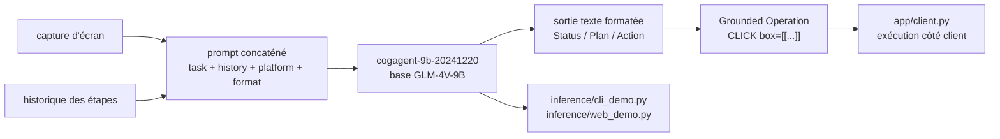

# THUDM/CogAgent

> **Un modèle vision-langage de 9B qui lit une capture d'écran et rend l'action GUI à exécuter.**

## Le problème

Automatiser une interface graphique sans API suppose de localiser l'élément à cliquer sur une
capture d'écran, puis de décider l'opération. Les modèles conversationnels généralistes ne
renvoient pas de coordonnées exploitables, et il faut sinon coller un modèle de *grounding*
externe derrière un LLM.

## Ce que ça fait vraiment

`cogagent-9b-20241220` prend en entrée une capture d'écran, une description de tâche, la
plateforme (`WIN`, `Mac`, `Mobile`) et l'historique des étapes déjà exécutées, et renvoie une
chaîne dans un format strict. Selon le `format_key` demandé, la réponse contient les champs
`Status`, `Plan`, `Action`, `Grounded Operation`, et un marqueur de sensibilité
`<<敏感操作>>` / `<<一般操作>>`. L'opération est du type `CLICK(box=[[...]], element_info=...)`,
`TYPE(...)`, `SCROLL_DOWN(...)` — l'espace d'actions est décrit dans `Action_space.md`. Le
modèle est bilingue chinois/anglais et dérive de GLM-4V-9B. Il n'exécute rien lui-même : il
prédit l'action, c'est le code appelant qui clique.

## Comment c'est branché



Le README renvoie à `app/client.py#L115` pour la construction du prompt, à
`inference/cli_demo.py` et `inference/web_demo.py` pour l'inférence, à `finetune/README.md`
pour le fine-tuning et à `app/README.md` pour l'application de démonstration.

## Essayer

```shell
pip install -r requirements.txt
```

```shell
python inference/cli_demo.py --model_dir THUDM/cogagent-9b-20241220 --platform "Mac" --max_length 4096 --top_k 1 --output_image_path ./results --format_key status_action_op_sensitive
```

```shell
python inference/web_demo.py --host 0.0.0.0 --port 7860 --model_dir THUDM/cogagent-9b-20241220 --format_key status_action_op_sensitive --platform "Mac" --output_dir ./results
```

Python 3.10.16 ou supérieur est requis.

## Coût et pièges

Le README annonce au moins 29 Go de VRAM en `BF16` pour l'inférence ; `INT8` environ 15 Go,
`INT4` environ 8 Go mais déconseillé pour perte de performance, et seulement sur matériel
NVIDIA. Le SFT gèle le `Vision Encoder`, tourne sur `8 * A100` et demande au moins 60 Go par
GPU ; le LoRA demande au moins 70 Go sur un seul GPU, non répartissable. Les démos en ligne
ne pilotent aucun ordinateur : elles montrent seulement l'inférence. Le code est sous
Apache 2.0, les poids sous un `MODEL_LICENSE` distinct dont le README ne donne pas les termes.

## Ce que ce n'est pas

Ce n'est pas un modèle de conversation : pas de dialogue continu, seulement un historique
d'exécution à re-fournir à chaque tour. Ce n'est pas non plus un agent complet qui pilote la
machine — le dépôt fournit le modèle et des démos, l'exécution des clics reste à votre charge
et le README avertit qu'il ne garantit pas la sûreté du comportement. La sortie est une
chaîne au format imposé, pas du JSON, et une image en entrée est obligatoire.

## Alternatives

Le README cite comme comparaisons Qwen2-VL, ShowUI, SeeClick (modèles GUI open source),
GPT-4o + UGround ou OS-ATLAS, et Claude-3.5-Sonnet côté API commerciale, ainsi que le dépôt
antérieur THUDM/CogVLM pour la première génération de CogAgent. Parmi les voisins du
catalogue, aucune alternative comparable : google/adk-samples, asterdex/api-docs,
githubnext/gh-aw et steveyegge/gastown ne traitent pas de perception GUI.

## Pour toi

Intéressant si tu explores les agents GUI et que tu disposes d'un A100 ou équivalent : c'est
un des rares modèles ouverts qui rend directement des coordonnées d'action. Sans GPU 30 Go+,
et sans clarté sur la licence des poids, la surveillance suffit.
