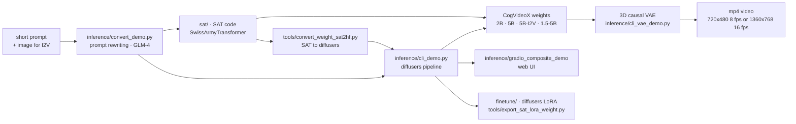

# THUDM/CogVideo

> **Open weights and inference code for the CogVideoX video generation models, to run on your own GPU.**

## The problem

Text-to-video normally means a hosted service: you send a prompt, pay per clip, and can
inspect neither the weights nor the pipeline. The moment you want to fine-tune on a domain,
condition on a first frame, or wire generation into an internal chain, the closed service
becomes a wall.

## What it actually does

The repository ships a family of video diffusion models — CogVideoX-2B, CogVideoX-5B,
CogVideoX-5B-I2V, then CogVideoX1.5-5B and CogVideoX1.5-5B-I2V — each with weights on
HuggingFace, ModelScope and WiseModel, in two flavours: a `diffusers` version and a SAT
(SwissArmyTransformer) version, plus `tools/convert_weight_sat2hf.py` to move between them.

Three tasks are covered per the README: text-to-video, image-to-video (the image acts as
background) and video continuation. The specs are tabulated: 720×480 at 8 fps over 6 seconds
for CogVideoX-2B/5B, 1360×768 at 16 fps over 5 or 10 seconds for the 1.5 line, a constrained
frame count (`8N+1` with N ≤ 6, `16N+1` with N ≤ 10), English-only prompts capped at 224 or
226 tokens.

Around the weights sits the code: `inference/cli_demo.py` (annotated inference),
`inference/cli_demo_quantization.py` (INT8 / FP8), `inference/cli_vae_demo.py` (the 3D causal
VAE alone), `inference/gradio_composite_demo` (the HuggingFace Space UI, with frame
interpolation and super-resolution), `inference/ddim_inversion.py`, `finetune/README.md`
(LoRA fine-tuning on the diffusers side), `sat/README.md`, and a `tools/` folder (LoRA
export/loading, captioning, multi-GPU parallel inference via xDiT).

Easily missed: `inference/convert_demo.py` rewrites the user's short prompt into a long one
using an LLM (GLM-4 by default, swappable for GPT or Gemini), because the model was trained
on long texts. The README states this step directly drives output quality.

## How it is wired



No code-derived diagram exists for this repository: the graph is reconstructed from the
README alone, though every filename in it is quoted verbatim. What it shows is the two-track
split — `diffusers` on one side, SAT on the other — running through the whole repo: they load
different weights, and only the `diffusers` track supports quantization.

## Trying it

```bash
pip install -r requirements.txt
```

Then follow `inference/cli_demo.py` (the README points at the file without giving a full
command line); for the SAT track, follow `sat/README.md`. The README is firm about Python:

```
Please make sure your Python version is between 3.10 and 3.12, inclusive of both 3.10 and 3.12.
```

The memory optimizations named in the README, to enable or disable inside the script:

```
pipe.enable_sequential_cpu_offload()
pipe.vae.enable_slicing()
pipe.vae.enable_tiling()
```

No complete inference command appears in the README: it defers to the scripts and to four
free Colab (T4) notebooks for T2V, quantized T2V, I2V and V2V.

## Cost and gotchas

- **VRAM** varies wildly by track. SAT: 18 GB (2B, FP16), 26 GB (5B, BF16), **76 GB** for
  1.5-5B — out of reach for a single consumer card. `diffusers` with all optimizations on:
  from 4 GB (2B FP16), 5 GB (5B BF16), 10 GB (1.5-5B BF16), and 3.6–7 GB under INT8 torchao.
- **The low figure is conditional.** The README says so: without the optimizations memory use
  is about **3×** the table value — but 3–4× faster. Measurements were taken only on
  A100 / H100 and are claimed transferable only to NVIDIA Ampere and above.
- **Generation time is the real cost**: at 50 steps, ~90 s (2B) to ~180 s (5B) on one A100,
  and ~1000 s for a 5-second clip on 1.5-5B. The quantized T4 Colab is quoted at ~30 minutes
  per run. Multiply by however many attempts a prompt takes.
- **An API key upstream**: the prompt-rewriting step calls GLM-4, GPT or an equivalent —
  billed separately and not provided. It is optional, but the README warns quality depends
  on it.
- **INT8 slows inference down** (the accepted trade for small cards), INT4 is unsupported,
  and FP8 requires H100 or above with `torch` and `torchao` built from source, CUDA 12.4
  recommended.
- **Multi-GPU** requires disabling `enable_sequential_cpu_offload()`, which pushes memory back
  up (10–24 GB depending on the model).
- **Two licence regimes**: the code and the 2B model are Apache 2.0; the 5B model (T2V and
  I2V, Transformers module) sits under a bespoke "CogVideoX LICENSE" hosted on HuggingFace.
  The most interesting model is the one carrying the special terms — read them before any
  commercial use. Hence the alert.

## What it is not

- **Not a service**: nothing is hosted here. The online demos (HuggingFace Space, ModelScope,
  QingYing) are shop windows; the README explicitly points to QingYing and Zhipu's API
  platform for "larger-scale commercial video generation models". What is open is not what is
  sold.
- **Not multilingual**: the models accept English only, and a short prompt yields a poor
  result. So an LLM sits upstream — a second dependency.
- **Not a long-shot generator**: 5, 6 or 10 seconds depending on the model, fixed resolution,
  frame count bound by a formula. Anything beyond that goes through third-party projects
  (RIFLEx for length extrapolation, for instance).
- **Not the most active repo in its own family**: the README itself redirects fine-tuning to
  `CogKit` and `cogvideox-factory`, and acceleration to xDiT or VideoSys.

## Alternatives

| | When to prefer it |
|---|---|
| **THUDM/CogKit** | Announced at the top of the README as the fine-tuning and inference framework for CogView4 *and* CogVideoX. Prefer it if the goal is to fine-tune rather than read the reference code — it is where the authors are heading. |
| **a-r-r-o-w/cogvideox-factory** | Cited twice in the README: cost-effective fine-tuning, `diffusers`-compatible, claimed feasible on a single RTX 4090, with multiple resolutions. Prefer it when GPU budget is the binding constraint. |
| **aigc-apps/CogVideoX-Fun** | Listed under friendly links: a modified pipeline on the same architecture, with flexible resolutions and several launch methods. Prefer it when the official repo's fixed resolution is the blocker. |

All three derive from CogVideoX rather than replace it: the README names no competing video
generation model, and no catalogue neighbours were supplied for this repository.

## For you

Worth watching rather than adopting: it is one of the few video model families where the
weights, the 3D VAE and the LoRA fine-tuning code are all public, so it is the right base for
understanding how a video DiT is assembled and for testing a domain fine-tune. But the entry
ticket is an Ampere card, quality hinges on a rewriting LLM, and the 5B licence forbids
committing without legal review. Skip it if you just need clips: a hosted service will cost
less than the GPU hours.
