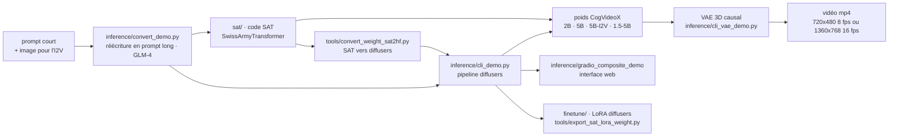

# THUDM/CogVideo

> **Les poids et le code d'inférence des modèles de génération vidéo CogVideoX, à faire tourner chez soi.**

## Le problème

Générer une vidéo à partir d'un texte passe d'ordinaire par un service en ligne : on envoie
son prompt, on paie au clip, et ni les poids ni le pipeline ne sont inspectables. Dès qu'on
veut affiner sur un domaine, contrôler la première image ou intégrer la génération dans une
chaîne interne, le service fermé devient un mur.

## Ce que ça fait vraiment

Le dépôt publie une famille de modèles de diffusion vidéo — CogVideoX-2B, CogVideoX-5B,
CogVideoX-5B-I2V, puis CogVideoX1.5-5B et CogVideoX1.5-5B-I2V — avec pour chacun les poids
sur HuggingFace, ModelScope et WiseModel, en deux formats : la version `diffusers` et la
version SAT (SwissArmyTransformer), plus un outil `tools/convert_weight_sat2hf.py` pour
passer de l'une à l'autre.

Trois tâches sont couvertes d'après le README : texte-vers-vidéo, image-vers-vidéo
(l'image sert de fond) et continuation de vidéo. Les caractéristiques sont tabulées :
720×480 à 8 images/s sur 6 secondes pour la génération CogVideoX-2B/5B, 1360×768 à
16 images/s sur 5 ou 10 secondes pour la 1.5, nombre d'images contraint (`8N+1` avec N ≤ 6,
`16N+1` avec N ≤ 10), prompt en anglais uniquement, limité à 224 ou 226 tokens.

Autour des poids, le dépôt fournit le code : `inference/cli_demo.py` (inférence commentée),
`inference/cli_demo_quantization.py` (INT8 / FP8), `inference/cli_vae_demo.py` (le VAE 3D
causal seul), `inference/gradio_composite_demo` (l'interface web de la Space HuggingFace,
avec interpolation d'images et super-résolution), `inference/ddim_inversion.py`,
`finetune/README.md` (fine-tuning LoRA côté diffusers), `sat/README.md` (inférence et
fine-tuning côté SAT) et un dossier `tools/` (export/chargement de LoRA, génération de
légendes, inférence parallèle multi-GPU via xDiT).

Point souvent négligé : `inference/convert_demo.py` réécrit le prompt de l'utilisateur en
prompt long via un LLM (GLM-4 par défaut, remplaçable par GPT ou Gemini), parce que le
modèle a été entraîné sur des textes longs. Le README dit que cette étape conditionne
directement la qualité.

## Comment c'est branché



Aucun diagramme tiré du code n'existe pour ce dépôt : ce schéma est reconstruit depuis le
seul README, mais les noms de fichiers y sont cités tels quels. Ce qu'il montre, c'est la
double voie — `diffusers` d'un côté, SAT de l'autre — qui traverse tout le dépôt : les deux
lisent des poids différents, et seule la voie `diffusers` supporte la quantification.

## Essayer

```bash
pip install -r requirements.txt
```

Puis suivre `inference/cli_demo.py` (le README pointe vers ce fichier, sans donner la ligne
de commande complète) ; pour la voie SAT, suivre `sat/README.md`. Le README insiste sur la
version de Python :

```
Please make sure your Python version is between 3.10 and 3.12, inclusive of both 3.10 and 3.12.
```

Les optimisations mémoire citées dans le README, à activer ou désactiver dans le script :

```
pipe.enable_sequential_cpu_offload()
pipe.vae.enable_slicing()
pipe.vae.enable_tiling()
```

Aucune commande d'inférence complète n'est écrite dans le README : il renvoie aux scripts et
à quatre notebooks Colab gratuits (T4) pour T2V, T2V quantifié, I2V et V2V.

## Coût et pièges

- **VRAM** : très variable selon la voie. Côté SAT, 18 Go (2B, FP16), 26 Go (5B, BF16),
  **76 Go** pour la 1.5-5B — hors de portée d'une carte unique grand public. Côté
  `diffusers` avec toutes les optimisations : à partir de 4 Go (2B FP16), 5 Go (5B BF16),
  10 Go (1.5-5B BF16), et 3,6 à 7 Go en INT8 torchao.
- **Le chiffre bas est conditionnel.** Le README le dit : sans les optimisations, la
  consommation est environ **3 fois** la valeur du tableau — mais 3 à 4 fois plus rapide. Les
  mesures n'ont été faites que sur A100 / H100, et ne sont annoncées transférables qu'aux
  architectures NVIDIA Ampere et plus.
- **Le temps de génération est le vrai coût** : pour 50 pas, ~90 s (2B) à ~180 s (5B) sur une
  A100, et ~1000 s pour une vidéo de 5 s en 1.5-5B. Le Colab T4 quantifié est donné à
  ~30 minutes par exécution. Multiplier par le nombre d'essais qu'un prompt demande.
- **Clé d'API en amont** : l'étape de réécriture du prompt appelle GLM-4, GPT ou équivalent —
  facturée à part, et non fournie. Rien n'oblige à l'utiliser, mais le README avertit que la
  qualité en dépend.
- **INT8 ralentit** l'inférence (c'est le compromis assumé pour les petites cartes), et INT4
  n'est pas supporté. FP8 exige H100 ou plus, avec `torch` et `torchao` installés depuis les
  sources et CUDA 12.4 recommandé.
- **Multi-GPU** : il faut désactiver `enable_sequential_cpu_offload()`, ce qui remonte la
  consommation (10 à 24 Go selon le modèle).
- **Licence en deux régimes** : le code et le modèle 2B sont sous Apache 2.0 ; le modèle 5B
  (T2V et I2V, module Transformers) est sous une « CogVideoX LICENSE » propre, hébergée sur
  HuggingFace. C'est le modèle le plus intéressant qui porte la licence particulière — à lire
  avant tout usage commercial. D'où l'alerte.

## Ce que ce n'est pas

- **Ce n'est pas un service** : rien n'est hébergé ici. Les démos en ligne (Space HuggingFace,
  ModelScope, QingYing) sont des vitrines ; le README renvoie explicitement vers QingYing et
  la plateforme d'API de Zhipu pour « des modèles commerciaux de plus grande échelle ». Ce qui
  est ouvert n'est pas ce qui est vendu.
- **Ce n'est pas multilingue** : les modèles n'acceptent que l'anglais, et un prompt court
  donne un mauvais résultat. Il faut donc un LLM en amont, c'est-à-dire une seconde dépendance.
- **Ce n'est pas un générateur de longs plans** : 5, 6 ou 10 secondes selon le modèle, à une
  résolution fixe, avec un nombre d'images contraint par une formule. Tout ce qui dépasse
  passe par des projets tiers (RIFLEx pour l'extrapolation de longueur, par exemple).
- **Ce n'est pas le dépôt le plus actif de la famille** : le README lui-même redirige le
  fine-tuning vers `CogKit` et `cogvideox-factory`, et l'accélération vers xDiT ou VideoSys.

## Alternatives

| | Quand le préférer |
|---|---|
| **THUDM/CogKit** | Annoncé en tête du README comme le cadre de fine-tuning et d'inférence pour CogView4 *et* CogVideoX. À préférer si l'objectif est d'affiner plutôt que de lire le code de référence — c'est la direction que prennent les auteurs. |
| **a-r-r-o-w/cogvideox-factory** | Cité deux fois dans le README : fine-tuning à coût réduit, compatible `diffusers`, annoncé faisable sur un seul RTX 4090, avec plusieurs résolutions. À préférer quand le budget GPU est la contrainte. |
| **aigc-apps/CogVideoX-Fun** | Cité dans les liens amis : pipeline modifié sur la même architecture, résolutions flexibles et plusieurs modes de lancement. À préférer si la contrainte de résolution fixe du dépôt officiel bloque. |

Ces trois projets dérivent de CogVideoX plutôt qu'ils ne le remplacent : le README ne nomme
aucun modèle de génération vidéo concurrent, et aucun voisin n'a été fourni avec ce dépôt.

## Pour toi

À surveiller plutôt qu'à adopter : c'est une des rares familles de modèles vidéo dont les
poids, le VAE 3D et le code de fine-tuning LoRA sont publics, donc la bonne base pour
comprendre comment un DiT vidéo est assemblé et pour tester un affinage sur un domaine
métier. Mais le ticket d'entrée reste une carte Ampere, la qualité dépend d'un LLM de
réécriture, et la licence du 5B interdit de s'engager sans lecture juridique. À écarter si le
besoin est simplement de produire des clips : un service en ligne coûtera moins cher que les
heures de GPU.
