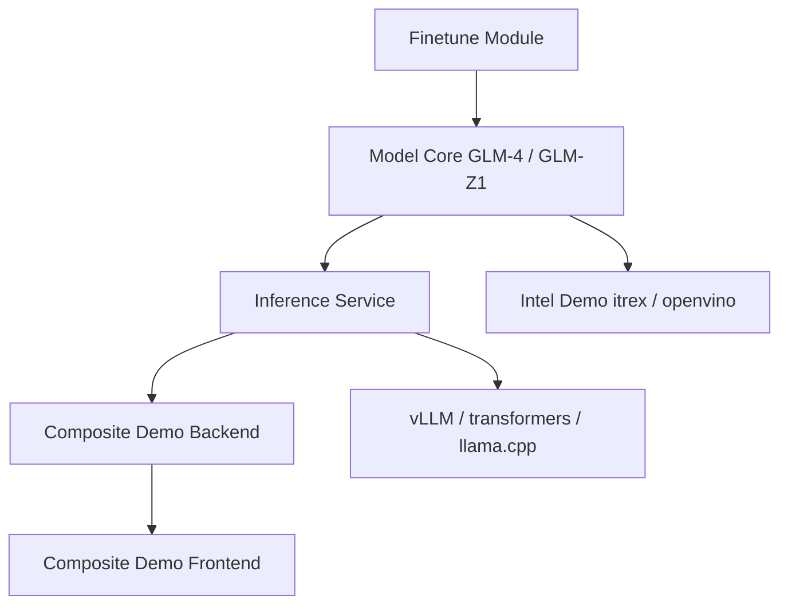

# THUDM/GLM-4

> Famille de modèles ouverts GLM-4-0414 et GLM-Z1 (9B et 32B), avec code de fine-tuning et d'inférence.

## Le problème
Disposer de modèles ouverts de taille locale (9B, 32B) pour chat, code, appel de fonctions et raisonnement.

## Ce que ça fait vraiment
Le dépôt regroupe les fiches de modèles (Chat, Base, Reasoning, Rumination), des scripts d'inférence (CLI, web, batch), un dossier finetune (LoRA, SwanLab en option) et deux démos (composite, Intel). Contexte natif 32K, YaRN conseillé au-delà. Les scores fournis sont ceux des auteurs.

## Comment c'est branché


## Essayer
```bash
cd finetune
pip install -r ../inference/requirements.txt
pip install -r requirements.txt
python finetune.py  data/AdvertiseGen/  zai-org/GLM-4-9B-0414  configs/lora.yaml
```

## Coût et pièges
GPU requis pour le 32B ; le 9B vise les ressources limitées. Le modèle Rumination exige un moteur de recherche externe et ignore prompts système et outils personnalisés. Licence non déclarée dans le catalogue : vérifier sur chaque modèle.

## Ce que ce n'est pas
Pas une API prête à l'emploi (les services hébergés sont sur Z.ai et bigmodel.cn) ; benchmarks non recoupés.

## Alternatives
- Aucune alternative nommée dans le README (il compare seulement à GPT-4o, DeepSeek et Qwen).

## Pour toi
À surveiller : un 9B/32B ouvert avec scripts LoRA est un candidat crédible pour tes essais locaux, à valider par tes propres évaluations et après vérification de la licence.
