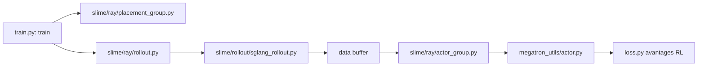

# THUDM/slime

> Framework de post-entraînement RL reliant Megatron pour l'entraînement et SGLang pour le rollout.

## Le problème
Les piles RL empilent trainers, services de rollout et frameworks d'agents découplés, et les bugs RL sont silencieux : rien ne plante, la courbe est juste fausse.

## Ce que ça fait vraiment
Fait passer entraînement Megatron, rollout SGLang, génération de données, calcul de récompense et interaction d'environnement par un seul chemin training / rollout / Data Buffer.
Passe-plat natif : les arguments Megatron sont lus directement, ceux de SGLang installés sont exposés avec le préfixe `--sglang-`.
Chemins de debug séparés rollout-seul et train-seul, tests CPU unitaires, tests de contrat sur les hooks, tests GPU de bout en bout.
PD Disaggregation, Delta Weight Sync, moteurs de rollout externes pouvant tourner sur d'autres GPU.

## Comment c'est branché


## Essayer
```bash
apt install pre-commit -y
pre-commit install
pre-commit run --all-files --show-diff-on-failure --color=always
```

## Coût et pièges
Post-entraînement de gros modèles : c'est du multi-GPU, aucune version légère n'est proposée. Le README ne donne aucune commande d'installation, tout renvoie au Quick Start Guide. Un seul backend de rollout, SGLang, par choix assumé.

## Ce que ce n'est pas
Pas un framework d'agents : les workflows agentiques se branchent comme génération de données via `--custom-generate-function-path`, ils ne forkent pas le noyau d'entraînement. Pas multi-backend : vLLM existe, mais via le projet dérivé `vime`. Les validations « battle-tested » citées portent sur les modèles GLM des auteurs.

## Alternatives
Dressage, Miles, vime, Relax — quatre frameworks construits *sur* slime, cités comme écosystème, dont vime pour qui veut vLLM plutôt que SGLang.

## Pour toi
Le socle RL le plus lisible du moment si tu fais du post-entraînement ; à lire même sans GPU, pour son découpage dataflow.
