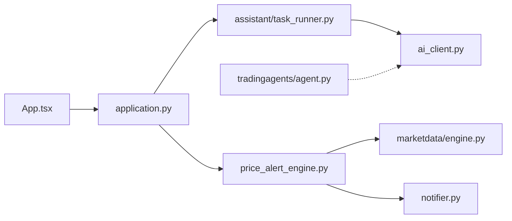

# TNT-Likely/PanWatch

> Application auto-hébergée de suivi boursier, avec analyses d'agents IA et alertes multi-canal.

## Le problème
Suivre un portefeuille sur les marchés A, Hong Kong et US oblige à croiser cours, news et indicateurs techniques toute la journée, sans rien qui en tire des actions concrètes.

## Ce que ça fait vraiment
Watchlist, portefeuilles multi-comptes, trading fictif, alertes de prix combinant des conditions en ET/OU avec délais et plafonds.
Agents planifiés : avant-séance, surveillance intraday (RSI, KDJ, MACD), rapport de clôture.
Analyse profonde via TradingAgents : quatre analystes, débat haussier/baissier, revue de risque, décision « PM », en 3 à 5 minutes.
Notifications Telegram, WeCom, DingTalk, Feishu, Bark, webhooks. FastAPI, SQLAlchemy, APScheduler, React ; export OpenTelemetry optionnel avec spans GenAI.

## Comment c'est branché


## Essayer
```bash
docker run -d --name panwatch --restart unless-stopped -p 8000:8000 -v panwatch_data:/app/data sunxiao0721/panwatch:latest
docker compose up -d
make dev-api
make dev-web
pip install -r requirements-otel.txt
```

## Coût et pièges
Modèle OpenAI-compatible à ta charge ; le README annonce environ 0,05 USD par analyse TradingAgents avec `deepseek-chat`, Ollama possible. Au premier démarrage, Chromium (Playwright) est téléchargé dans le volume, sauf `PLAYWRIGHT_SKIP_BROWSER_INSTALL=1`.

## Ce que ce n'est pas
Pas un courtier : le README ne documente aucun passage d'ordre réel, le trading proposé est fictif.
Pas un conseil fiable : la « décision PM » reste une sortie de LLM.
Fuseau par défaut `Asia/Shanghai`, à changer pour tes horaires.

## Alternatives
- TradingAgents : si seule l'analyse multi-agent t'intéresse, sans surveillance ni alertes.

## Pour toi
Hors périmètre sauf si tu investis ; son découpage OTel GenAI (run, appel LLM, nœud) mérite toutefois la lecture.
