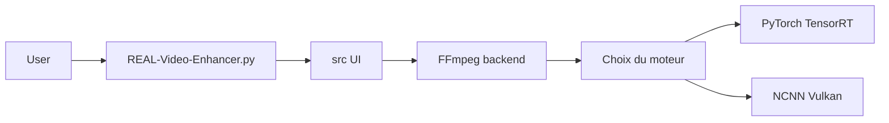

# TNTwise/REAL-Video-Enhancer

> Application de bureau pour interpoler des images et agrandir des vidéos par réseaux de neurones.

## Le problème
Passer une vidéo de 24 à 48 images par seconde ou la suragrandir demande d'enchaîner FFmpeg et des modèles complexes.

## Ce que ça fait vraiment
Une interface Qt pilote un backend Python : FFmpeg décode et encode, puis des moteurs d'inférence (PyTorch, TensorRT, NCNN, ONNX) exécutent des modèles d'interpolation (RIFE, GMFSS, IFRNet) et d'upscaling (SPAN, AnimeJaNai…), avec détection de changement de scène et aperçu. Disponible sous Windows, Linux (exécutable, Flatpak) et macOS.

## Comment c'est branché


## Essayer
```bash
git clone --recurse-submodules https://github.com/TNTwise/REAL-Video-Enhancer
python3 build.py --build BUILD_OPTION --copy_backend
```

## Coût et pièges
GPU recommandé (Nvidia RTX 20+, 8 Go de VRAM pour TensorRT), 16 à 32 Go de RAM. Le binaire Windows peut être signalé comme cheval de Troie (faux positif PyInstaller selon le README). Licence AGPL-3.0.

## Ce que ce n'est pas
Pas un service en ligne ni une bibliothèque : c'est une app. TensorRT met du temps à s'optimiser à la première vidéo.

## Alternatives
Le README cite Flowframes et enhancr comme logiciels dépassés.

## Pour toi
À surveiller : bon exemple de packaging multi-backend d'inférence, mais usage vidéo grand public.

