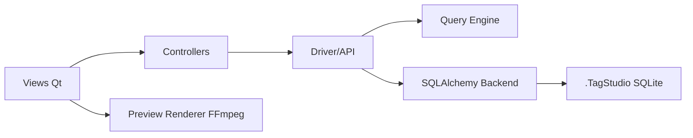

# TagStudioDev/TagStudio

> Application de bureau pour organiser photos et fichiers par tags, sans déplacer les fichiers.

## Le problème
Retrouver des fichiers dans de gros dossiers sans imposer une hiérarchie ni des fichiers annexes propriétaires.

## Ce que ça fait vraiment
Une « bibliothèque » se pose sur un dossier existant et stocke tags et champs dans une base SQLite dans `.TagStudio`. Tags avec alias, couleur et tags parents ; recherche avec opérateurs booléens, `path:`, `filetype:` et `mediatype:` ; aperçus de nombreux formats ; relink des fichiers déplacés. Version Alpha 9.5.5.

## Comment c'est branché

## Essayer
Aucune commande documentée dans le README : télécharger un exécutable depuis la page Releases GitHub (Windows, macOS, Linux).

## Coût et pièges
Gratuit. FFmpeg requis pour les vidéos, ripgrep conseillé. Seule la page Releases est officielle ; pas de gestionnaire de paquets. Faux positifs antivirus signalés (PyInstaller).

## Ce que ce n'est pas
Pas d'intégration cloud ni de LLM distant, exclus par l'auteur. Le relink ne couvre pas les fichiers renommés.

## Alternatives
Aucune alternative nommée dans le README.

## Pour toi
À ignorer : gestionnaire de fichiers personnel en alpha, sans usage direct en data/IA/MLOps.

