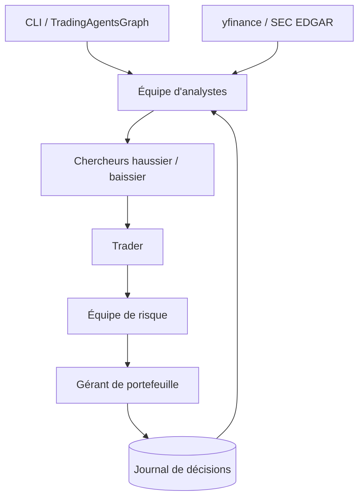

# TauricResearch/TradingAgents

> Cadre de recherche multi-agents LLM qui simule une salle de marché pour produire une décision.

## Le problème
Analyser une position demande de croiser fondamentaux, sentiment, actualités et technique.
Un seul prompt mélange tout et rend un avis sans trace de la contradiction entre points de vue.

## Ce que ça fait vraiment
Décompose le travail en rôles : quatre analystes, deux chercheurs (haussier et baissier) qui débattent,
un trader, une équipe de risque et un gérant de portefeuille qui approuve ou rejette l'ordre.
Construit sur LangGraph ; supporte une quinzaine de fournisseurs, Ollama et tout endpoint OpenAI-compatible.
Journalise chaque décision, calcule l'alpha réalisé au run suivant et réinjecte la leçon dans le prompt.
`run_backtest` rejoue le pipeline sur une grille de tickers et de dates et note les décisions échues.

## Comment c'est branché


## Essayer
```bash
git clone https://github.com/TauricResearch/TradingAgents.git
cd TradingAgents && pip install .
tradingagents
tradingagents backtest NVDA,AAPL --start 2026-06-01 --end 2026-08-01 --every 7
```

## Coût et pièges
Un run enchaîne beaucoup d'appels de modèles de raisonnement : la facture monte vite avec les rounds de débat.
SEC EDGAR ne demande pas de clé mais exige un `SEC_EDGAR_USER_AGENT` avec une adresse de contact réelle.

## Ce que ce n'est pas
Pas un conseil financier ni une stratégie : le README le dit, c'est un échafaudage de recherche.
Pas reproductible — deux runs identiques divergent, et les backtests ne rejouent aucun chiffre publié.
Les agents ignorent tes positions sauf si tu passes explicitement un `PortfolioContext`.

## Alternatives
- `langchain-ai/langchain` : la brique d'orchestration sous-jacente, sans le domaine métier.

## Pour toi
Bon objet d'étude sur le débat multi-agents et la mémoire de décisions ; à ne jamais brancher sur de l'argent réel.
