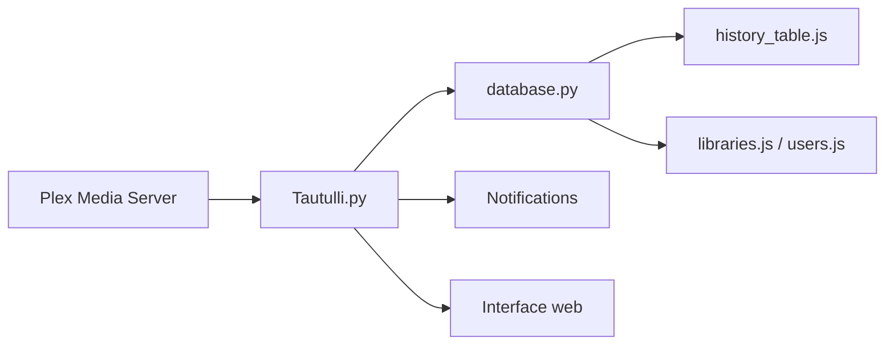

# Tautulli/Tautulli

> Application web Python de suivi, statistiques et notifications pour serveurs Plex, pour particuliers qui hébergent leurs médias.

## Le problème
Plex ne donne pas d'historique détaillé des lectures, des utilisateurs et des appareils, ni d'alertes personnalisées.

## Ce que ça fait vraiment
Surveille l'activité du serveur Plex en direct, conserve l'historique de visionnage, produit des statistiques et des graphiques Highcharts, et envoie des notifications configurables (flux en cours, médias ajoutés). Inclut pages utilisateurs, bibliothèques et liste de synchronisation. Publié en Docker, snap et installeurs Windows/macOS ; Python 3.10 ou plus.

## Comment c'est branché

## Essayer
Aucune commande documentée dans le README fourni : il renvoie aux guides d'installation du wiki.

## Coût et pièges
Gratuit, mais inutile sans serveur Plex. Trois branches (master, beta, nightly). Le README contient une déclaration d'usage de l'IA par les mainteneurs (10 août 2026).

## Ce que ce n'est pas
Pas un outil de données ou d'IA : c'est de la supervision de médiathèque personnelle.

## Alternatives
Aucune alternative citée dans le README.

## Pour toi
À ignorer pour un profil data/IA/MLOps : hors sujet professionnel, utile seulement si tu héberges Plex ; GPL-3.0.

