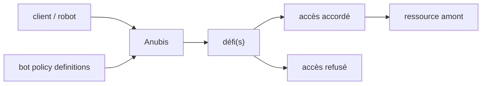

# TecharoHQ/anubis

> Pare-feu applicatif qui impose des défis aux clients pour écarter les robots d'aspiration.

## Le problème
Les robots des entreprises d'IA saturent les petits sites : la bande passante et le CPU partent dans
des requêtes automatisées que le serveur d'origine paie.

## Ce que ça fait vraiment
Anubis s'interpose devant une ressource et « pèse l'âme » de la connexion au moyen d'un ou plusieurs
défis avant de laisser passer. Le README le décrit comme aussi léger que possible, pour rester
abordable. Des définitions de politique de robots permettent de mettre explicitement en liste
d'autorisation les robots que l'on veut garder ; un ensemble de « bons robots » connus est en cours
de constitution. Aucun détail sur la nature des défis, l'installation ou la configuration n'est
donné dans ce README.

## Comment c'est branché

## Essayer
Aucune commande n'est documentée dans ce README ; il renvoie au site `anubis.techaro.lol`.

## Coût et pièges
Le README avertit lui-même : c'est une réponse nucléaire. Le site sera bloqué pour les petits
aspirateurs et peut gêner les « bons robots » comme Internet Archive. Ni licence, ni prérequis,
ni déploiement ne sont indiqués ici.

## Ce que ce n'est pas
Pas un besoin courant : le README dit que dans la plupart des cas on n'en a pas besoin et que
Cloudflare suffit — Anubis vise les situations où l'on ne peut pas ou ne veut pas l'utiliser.
Pas un filtre sélectif prêt à l'emploi : la liste blanche est à écrire soi-même.

## Alternatives
- Cloudflare : nommé par le README comme la solution à préférer par défaut.

## Pour toi
Sans objet pour ton travail data ; utile à connaître si tu héberges un site public à ton nom.
