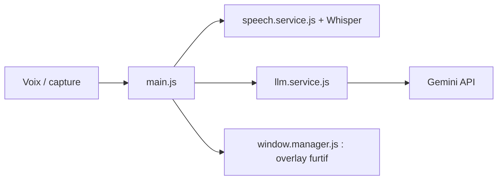

# TechyCSR/OpenCluely

> Copilote d'entretien technique dont l'overlay est invisible aux outils de partage d'écran.

## Le problème
Le README vise à obtenir de l'aide IA en temps réel pendant des entretiens techniques, sans que l'interlocuteur la voie.

## Ce que ça fait vraiment
Appli Electron : capture d'écran envoyée directement à Gemini, voix transcrite par Whisper local ou Azure Speech, réponses en streaming dans un overlay et un chat, mémoire de session. Les fenêtres se cachent des captures Zoom, Meet, Teams, Discord, OBS et se masquent au début d'un partage. Installateurs Windows et Linux ; macOS depuis les sources.

## Comment c'est branché


## Essayer
```bash
git clone https://github.com/TechyCSR/OpenCluely.git
cd OpenCluely
./setup.sh
```
Puis coller la clé `GEMINI_API_KEY` dans les Réglages.

## Coût et pièges
Clé Gemini (gratuite via Google AI Studio d'après le README) ; Whisper local pèse en disque et CPU/GPU. Le README dit « responsable des règles de l'entretien ».

## Ce que ce n'est pas
Pas un outil de préparation honnête : la fonction phare est de dissimuler l'aide, ce qui peut enfreindre les règles d'un recrutement.

## Alternatives
Le README cite Vysper comme inspiration d'interface.

## Pour toi
À ignorer : sa valeur repose sur la dissimulation en entretien, avec des risques éthiques et professionnels, et il n'apporte rien à un travail data.
