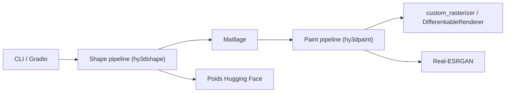

# Tencent-Hunyuan/Hunyuan3D-2.1

> Système ouvert qui génère un maillage 3D texturé en PBR à partir d'une image, pour recherche et 3D.

## Le problème
Créer un actif 3D texturé à partir d'une image demande modélisation et texturage manuels.

## Ce que ça fait vraiment
Deux étapes : Hunyuan3D-Shape (3,3 B, flow matching) produit le maillage, puis Hunyuan3D-Paint (2 B) applique des textures PBR via rendu différentiable et inpainting. Poids et code d'entraînement publiés. API de style diffusers et application Gradio ; rastériseur CUDA compilé localement.

## Comment c'est branché


## Essayer
```bash
pip install torch==2.5.1 torchvision==0.20.1 torchaudio==2.5.1 --index-url https://download.pytorch.org/whl/cu124
pip install -r requirements.txt
python3 gradio_app.py \
  --model_path tencent/Hunyuan3D-2.1 \
  --subfolder hunyuan3d-dit-v2-1 \
  --texgen_model_path tencent/Hunyuan3D-2.1 \
  --low_vram_mode
```

## Coût et pièges
VRAM annoncée : 10 Go (forme), 21 Go (texture), 29 Go (les deux). Compilation d'extensions C++/CUDA nécessaire, PyTorch 2.5.1 cu124 testé.

## Ce que ce n'est pas
La licence n'est pas identifiée par GitHub : vérifier ses conditions avant usage commercial. Comparatifs chiffrés fournis par les auteurs eux-mêmes.

## Alternatives
- Trellis, TripoSG, Step1X-3D : comparés dans le tableau de résultats du README.

## Pour toi
À surveiller : intéressant si tu as un GPU 24 Go+ et un besoin 3D, mais licence à lire avant tout usage.

