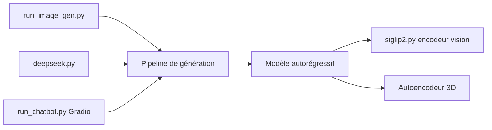

# Tencent-Hunyuan/HunyuanImage-3.0

> Modèle multimodal autorégressif de génération et d'édition d'images, pour équipes disposant de plusieurs GPU 80 Go.

## Le problème
Les modèles d'image ouverts reposent surtout sur des architectures de diffusion ; ici Tencent propose un modèle unifié texte-image qui comprend et génère.

## Ce que ça fait vraiment
Modèle MoE de 80 milliards de paramètres (13 milliards actifs par token, 64 experts). Trois checkpoints : base (texte vers image), Instruct (édition, fusion jusqu'à 3 images, réécriture et raisonnement « think ») et Instruct-Distil (8 étapes). Interfaces : CLI `run_image_gen.py`, démo Gradio, intégration vLLM. Un réécrivain de prompt passe par Tencent Cloud (clés DeepSeek/LKEAP).

## Comment c'est branché


## Essayer
```bash
pip install torch==2.8.0 torchvision==0.23.0 torchaudio==2.8.0 --index-url https://download.pytorch.org/whl/cu128
pip install -r requirements.txt
hf download tencent/HunyuanImage-3.0-Instruct --local-dir ./HunyuanImage-3-Instruct
export MODEL_PATH="./HunyuanImage-3-Instruct"
bash run_demo_instruct.sh
```

## Coût et pièges
VRAM recommandée : au moins 3 × 80 Go (base) et 8 × 80 Go (Instruct). CUDA 12.8, Python 3.12+. Première inférence avec FlashInfer : environ 10 minutes de compilation. Le dossier du modèle ne doit pas contenir de point dans son nom.

## Ce que ce n'est pas
Pas exécutable sur un GPU grand public. Le « multi-tours » reste à faire. Les comparaisons annoncées face aux modèles fermés sont celles des auteurs. Licence présente mais non reconnue par GitHub : à lire avant tout usage commercial.

## Alternatives
Aucune alternative nommée dans le README.

## Pour toi
À surveiller : le modèle est intéressant techniquement, mais le matériel requis et la licence non identifiée empêchent un usage direct en équipe.

