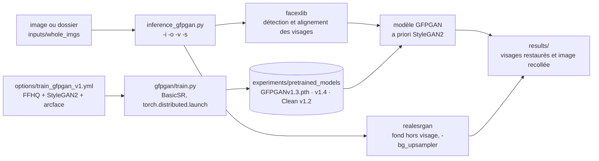

# TencentARC/GFPGAN

> **Restoring degraded faces in real-world photos, from a command-line script or a pip package.**

## The problem

An old, compressed or distant photograph yields faces that are blurred, noisy, with features
eaten away. General upscalers stretch the image without rebuilding what is missing: eyes,
mouth and skin stay unreadable because nothing about what a *face* is enters the computation.
Recovering those details by hand is retouching work, not batch processing.

## What it actually does

GFPGAN is the inference and training code of the paper *Towards Real-World Blind Face
Restoration with Generative Facial Prior* (CVPR 2021, Applied Research Center, Tencent PCG).
The stated principle: use the priors held in an already-trained face GAN (StyleGAN2 on FFHQ)
for so-called blind restoration — that is, without knowing the degradation the image suffered.

In practice, `inference_gfpgan.py` takes an image or a folder, detects and aligns faces
through `facexlib`, restores each face, then pastes the result back into the original image.
Non-face regions (the background) are not handled by GFPGAN itself: they go through an
external upsampler, Real-ESRGAN by default (`-bg_upsampler`). The final scale is set with
`-s` (default 2).

Three generations of weights are published as releases: V1 (the paper model, with
colorization, requiring compiled CUDA extensions), V1.2 (the "clean" version, no CUDA
extension, no colorization, sharper output), V1.3 (results described as more natural,
including on very low-quality inputs) and V1.4 (announced in the Updates section). The README
is explicit that V1.3 is not always better than V1.2: V1.3 is less sharp and slightly changes
identity, V1.2 is sharper but sometimes unnatural.

The repository also ships training code (`gfpgan/train.py` on top of BasicSR), a simpler
configuration that needs no facial component landmarks, and RestoreFormer inference code.

## How it is wired



No code-derived diagram exists for this repository: the graph above is reconstructed from the
README alone, from the paths and options it cites.

## Trying it

```bash
git clone https://github.com/TencentARC/GFPGAN.git
cd GFPGAN
```

```bash
# Install basicsr - https://github.com/xinntao/BasicSR
# We use BasicSR for both training and inference
pip install basicsr

# Install facexlib - https://github.com/xinntao/facexlib
# We use face detection and face restoration helper in the facexlib package
pip install facexlib

pip install -r requirements.txt
python setup.py develop

# If you want to enhance the background (non-face) regions with Real-ESRGAN,
# you also need to install the realesrgan package
pip install realesrgan
```

```bash
wget https://github.com/TencentARC/GFPGAN/releases/download/v1.3.0/GFPGANv1.3.pth -P experiments/pretrained_models
python inference_gfpgan.py -i inputs/whole_imgs -o results -v 1.3 -s 2
```

Training, exactly as the README gives it:

```bash
python -m torch.distributed.launch --nproc_per_node=4 --master_port=22021 gfpgan/train.py -opt options/train_gfpgan_v1.yml --launcher pytorch
```

With nothing installed: online demos are listed (Replicate, a Hugging Face Space with Gradio,
two Colab notebooks).

## Cost and traps

- **Stated requirements**: Python >= 3.7, PyTorch >= 1.7. An NVIDIA GPU + CUDA and Linux are
  explicitly marked "Option" — so CPU is possible, but the README gives no timing and no VRAM
  figure. Measure it yourself.
- **The paper model (V1) is not the default path**: it needs compiled CUDA extensions and a
  separate procedure described in `PaperModel.md`. The "clean" line (V1.2 onwards) exists
  precisely to avoid that compilation.
- **Weights do not ship with the package**: each `.pth` is downloaded from the GitHub releases
  (or Google Drive / Tencent Weiyun for the discriminators). Budget the download and its
  storage under `experiments/pretrained_models`.
- **Three heavy dependencies sit beside it**: `basicsr`, `facexlib`, and `realesrgan` if you
  want the background. Without `realesrgan`, only faces improve.
- **License**: the README shows an Apache 2.0 badge and the License and Acknowledgement section
  declares Apache 2.0, but the catalogue records `NOASSERTION` — GitHub could not identify the
  file. The intent is clear, the verification is not: read the repository `LICENSE` before any
  internal use, and separately check the licenses of StyleGAN2, FFHQ and ArcFace, whose weights
  feed the training.
- **Choosing a version is a trade-off, not an upgrade**: the README states plainly that V1.3 is
  not always better than V1.2, and that it can slightly alter the identity of the face.
- **Training requires FFHQ** plus, in the full configuration, pre-computed facial component
  landmarks and an ArcFace model: four weight files to fetch before the first iteration, on
  four GPUs in the command given.

## What it is not

- **It is not a general-purpose upscaler.** GFPGAN only handles faces; the rest of the image is
  delegated to Real-ESRGAN. Without that background upsampler you get an image in which only
  the faces changed.
- **It is not faithful restoration.** The model *reconstructs* detail from a face prior learned
  on FFHQ; the README itself reports a slight identity change in V1.3 and "beauty makeup" in
  V1.2. The output is plausible, not authentic: rule it out for forensic or evidentiary use.
- **It is not a turnkey service.** No HTTP API in the repository: a command-line script, a pip
  package, and demos hosted by third parties.
- **It is not a moving project.** The README stops at the V1.4 model and RestoreFormer: this is
  stabilised paper code, not a continuously developed product.

## Alternatives

| | When to prefer it |
|---|---|
| **xinntao/Real-ESRGAN** | Named in the README, and used by GFPGAN itself for the background. Prefer it when the image is not centred on a face, or for general and anime images. Complementary rather than competing. |
| **xinntao/BasicSR** | Named in the README: the image and video restoration toolbox GFPGAN depends on for training and inference. Prefer it if you want to build your own restoration pipeline rather than use a pre-trained model. |
| **wzhouxiff/RestoreFormer** | Named in the Updates: another face restoration approach, whose inference code is integrated into this repository. Worth a direct comparison on your own images. |

The other catalogue neighbours (`labmlai/annotated_deep_learning_paper_implementations`,
`onnx/onnx`, `autogluon/autogluon`) are not comparable: annotated paper implementations, a
model exchange format and a tabular AutoML library respectively — none restores a face.

## For you

Useful as a preprocessing brick whenever a photo dataset contains degraded faces, and as a
readable example of shipping a research model: inference script, pip package, weights
versioned as releases, training configuration provided. Handle it carefully on personal or
sensitive data — the model invents the detail it returns, and that invention propagates into
everything computed downstream.
