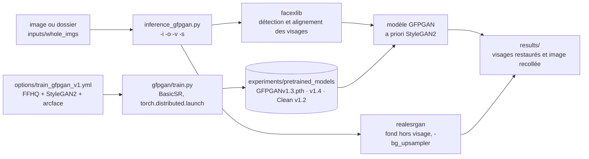

# TencentARC/GFPGAN

> **Restauration de visages dégradés sur photos réelles, en un script de ligne de commande ou un paquet pip.**

## Le problème

Une photo ancienne, compressée ou prise de trop loin donne des visages flous, bruités, aux
traits mangés. Les méthodes d'agrandissement générales étirent l'image sans reconstruire ce
qui manque : les yeux, la bouche et la peau restent illisibles parce qu'aucune information
sur ce qu'*est* un visage n'entre dans le calcul. Reconstruire ces détails à la main relève
de la retouche, pas du traitement par lot.

## Ce que ça fait vraiment

GFPGAN est le code d'inférence et d'entraînement de l'article *Towards Real-World Blind Face
Restoration with Generative Facial Prior* (CVPR 2021, Applied Research Center de Tencent PCG).
Le principe annoncé : exploiter les a priori contenus dans un GAN de visages déjà entraîné
(StyleGAN2 sur FFHQ) pour la restauration dite « aveugle » — c'est-à-dire sans connaître la
dégradation subie.

Concrètement, `inference_gfpgan.py` prend une image ou un dossier, détecte et aligne les
visages via `facexlib`, restaure chaque visage, puis recolle le résultat dans l'image
d'origine. Les régions hors visage (le fond) ne sont pas traitées par GFPGAN : elles passent
par un agrandisseur externe, Real-ESRGAN par défaut (`-bg_upsampler`). L'échelle finale se
règle par `-s` (défaut 2).

Trois générations de poids sont publiées en *releases* : V1 (le modèle de l'article, avec
colorisation, nécessite des extensions CUDA compilées), V1.2 (version « clean », sans
extension CUDA, sans colorisation, sortie plus nette), V1.3 (résultats présentés comme plus
naturels, y compris sur entrées très dégradées) et V1.4 (ajout signalé dans les *Updates*).
Le README précise que V1.3 n'est pas toujours meilleur que V1.2 : V1.3 est moins net et
modifie légèrement l'identité, V1.2 est plus net mais parfois peu naturel.

Le dépôt fournit aussi le code d'entraînement (`gfpgan/train.py` avec BasicSR), une variante
de configuration sans repères de composants faciaux, et le code d'inférence de RestoreFormer.

## Comment c'est branché



Aucun diagramme tiré du code n'existe pour ce dépôt : ce schéma est reconstruit depuis le seul
README, à partir des chemins et options qu'il cite.

## Essayer

```bash
git clone https://github.com/TencentARC/GFPGAN.git
cd GFPGAN
```

```bash
# Install basicsr - https://github.com/xinntao/BasicSR
# We use BasicSR for both training and inference
pip install basicsr

# Install facexlib - https://github.com/xinntao/facexlib
# We use face detection and face restoration helper in the facexlib package
pip install facexlib

pip install -r requirements.txt
python setup.py develop

# If you want to enhance the background (non-face) regions with Real-ESRGAN,
# you also need to install the realesrgan package
pip install realesrgan
```

```bash
wget https://github.com/TencentARC/GFPGAN/releases/download/v1.3.0/GFPGANv1.3.pth -P experiments/pretrained_models
python inference_gfpgan.py -i inputs/whole_imgs -o results -v 1.3 -s 2
```

Entraînement, tel que donné par le README :

```bash
python -m torch.distributed.launch --nproc_per_node=4 --master_port=22021 gfpgan/train.py -opt options/train_gfpgan_v1.yml --launcher pytorch
```

Sans rien installer : des démonstrations en ligne sont listées (Replicate, Hugging Face Spaces
avec Gradio, deux carnets Colab).

## Coût et pièges

- **Prérequis annoncés** : Python >= 3.7, PyTorch >= 1.7. GPU NVIDIA + CUDA et Linux sont
  explicitement marqués « Option » — donc le CPU est possible, mais le README ne donne aucun
  chiffre de temps ni de VRAM. À mesurer soi-même.
- **Le modèle de l'article (V1) n'est pas le chemin par défaut** : il demande des extensions
  CUDA compilées et une procédure séparée décrite dans `PaperModel.md`. La version « clean »
  (V1.2 et suivantes) existe précisément pour éviter cette compilation.
- **Les poids ne sont pas dans le paquet** : chaque `.pth` se télécharge depuis les *releases*
  GitHub (ou Google Drive / Tencent Weiyun pour les discriminateurs). Prévoir le téléchargement
  et son stockage dans `experiments/pretrained_models`.
- **Trois dépendances lourdes se posent à côté** : `basicsr`, `facexlib`, et `realesrgan` si on
  veut le fond. Sans `realesrgan`, seuls les visages sont améliorés.
- **Licence** : le README affiche un badge Apache 2.0 et la section *License and Acknowledgement*
  déclare Apache 2.0, mais le catalogue relève `NOASSERTION` — GitHub n'a pas su identifier le
  fichier. L'intention est claire, la vérification ne l'est pas : lire le `LICENSE` du dépôt
  avant tout usage interne, et vérifier séparément les licences de StyleGAN2, FFHQ et ArcFace
  dont les poids servent à l'entraînement.
- **Le choix de version est un arbitrage, pas une montée en gamme** : le README dit noir sur
  blanc que V1.3 n'est pas toujours meilleur que V1.2, et qu'il peut modifier légèrement
  l'identité du visage.
- **Entraîner demande FFHQ** et, dans la configuration complète, des repères de composants
  faciaux pré-calculés et un modèle ArcFace : quatre poids à récupérer avant la première
  itération, sur quatre GPU dans la commande donnée.

## Ce que ce n'est pas

- **Ce n'est pas un agrandisseur d'image généraliste.** GFPGAN ne traite que les visages ; le
  reste de l'image est délégué à Real-ESRGAN. Sans cet agrandisseur de fond, on obtient une
  image dont seuls les visages ont changé.
- **Ce n'est pas une restauration fidèle.** Le modèle *reconstruit* des détails à partir d'un
  a priori de visages appris sur FFHQ ; le README signale lui-même un léger changement
  d'identité en V1.3 et du « maquillage » en V1.2. Le résultat est plausible, pas authentique :
  à écarter pour tout usage médico-légal ou probatoire.
- **Ce n'est pas un service clé en main.** Pas d'API HTTP dans le dépôt : un script en ligne de
  commande, un paquet pip, et des démonstrations hébergées par des tiers.
- **Ce n'est pas un projet qui bouge.** Le README s'arrête aux modèles V1.4 et RestoreFormer :
  c'est un code de publication stabilisé, pas un produit en développement continu.

## Alternatives

| | Quand le préférer |
|---|---|
| **xinntao/Real-ESRGAN** | Nommé dans le README, et utilisé par GFPGAN lui-même pour le fond. À préférer quand l'image n'est pas centrée sur un visage, ou pour des images générales et de l'animé. Complémentaire plus que concurrent. |
| **xinntao/BasicSR** | Nommé dans le README : la boîte à outils de restauration d'images et de vidéos dont GFPGAN dépend pour l'entraînement et l'inférence. À préférer si l'on veut construire sa propre chaîne de restauration plutôt qu'utiliser un modèle déjà entraîné. |
| **wzhouxiff/RestoreFormer** | Nommé dans les *Updates* : autre approche de restauration de visages, dont le code d'inférence est intégré au dépôt. À essayer en comparaison directe sur ses propres images. |

Les autres voisins du catalogue (`labmlai/annotated_deep_learning_paper_implementations`,
`onnx/onnx`, `autogluon/autogluon`) ne sont pas comparables : ce sont respectivement des
implémentations commentées d'articles, un format d'échange de modèles et une bibliothèque
d'AutoML tabulaire — aucun ne restaure de visage.

## Pour toi

Utile comme brique de prétraitement dès qu'un jeu de données photo contient des visages
dégradés, et comme exemple lisible de mise en service d'un modèle de recherche : script
d'inférence, paquet pip, poids versionnés en *releases*, configuration d'entraînement fournie.
À manier avec prudence sur des données personnelles ou sensibles — le modèle invente les
détails qu'il restitue, et cette invention se propage à tout ce qui est calculé en aval.
