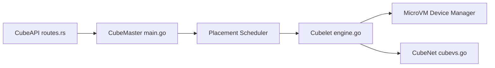

# TencentCloud/CubeSandbox

> Service de bacs à sable microVM isolés, compatibles E2B, pour exécuter le code d'agents IA.

## Le problème
Faire exécuter du code généré par un agent exige une isolation forte et un démarrage rapide.

## Ce que ça fait vraiment
Chaque bac à sable est une microVM KVM (RustVMM) avec son noyau. Annonce : démarrage sous 60 ms, moins de 5 Mo de surcoût, snapshots et retour arrière, volumes, isolation réseau eBPF, proxy L7 d'injection d'identifiants. Compatible avec le SDK E2B en changeant une variable d'environnement. Console web sur le port 12088.

## Comment c'est branché


## Essayer
```bash
# Aucune commande shell dans ce README ; ouvrir la console après déploiement :
# http://<control-node IP>:12088
```

## Coût et pièges
Linux x86_64 avec KVM requis (l'environnement dev est « déconseillé, performances faibles »). Déploiement Kubernetes en aperçu. Chiffres de performance fournis par le projet. Licence non identifiée.

## Ce que ce n'est pas
Ce n'est pas un simple conteneur Docker : c'est une infrastructure à déployer. Dépôt récent (avril 2026).

## Alternatives
- E2B : le README la cite comme interface compatible et cloud de référence.

## Pour toi
Surveiller : pertinent pour exécuter des agents en sécurité sur ta propre infrastructure, mais jeune, à licence à vérifier et exigeant du KVM.

