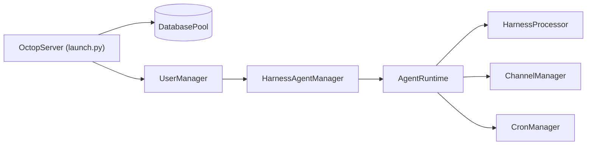

# TencentCloud/Octop

> Assistant IA auto-hébergé, multi-utilisateur et multi-agent, pour foyers et petites équipes.

## Le problème
Les assistants IA hébergés gardent conversations, fichiers et identifiants chez le fournisseur, et se partagent mal entre plusieurs personnes aux besoins différents.

## Ce que ça fait vraiment
Un seul processus Python (FastAPI) sert tableau de bord web, CLI, messageries (Feishu, DingTalk, QQ, Discord, WeCom) et cron ; tout l'état est dans `~/.octop/` (SQLite par défaut, PostgreSQL en option).
Chaque utilisateur a plusieurs agents avec workspace, fournisseurs, canaux et cron propres ; bibliothèque d'experts, 16 personas MBTI.
RAG sur tes documents, connecteurs OAuth et MCP, plugins, Chromium sans tête, terminal et bureau à distance.
ACP dans les deux sens : `octop acp` pour un IDE, ou délégation à OpenCode, Claude Code, Codex. JWT, approbation des outils, règles shell, masquage de PII.

## Comment c'est branché


## Essayer
```bash
curl -fsSL https://finnie-1258344699.cos.ap-guangzhou.myqcloud.com/octop/install.sh | bash
octop init
octop run
docker compose -f docker/docker-compose.yml up -d
```

## Coût et pièges
Gratuit en soi ; modèles à ta charge (ou locaux). Installation recommandée par `curl | bash` depuis un bucket COS. Quelques Go de RAM, plus les caches de modèles et d'embeddings.

## Ce que ce n'est pas
Pas entièrement ouvert aujourd'hui : harness-agent, harness-gateway, harness-memory et harness-browser sont « en préparation » pour l'open source, sans lien publié.
Pas distribué : un seul processus, sans file de messages.
Support surtout en chinois (groupe WeCom).

## Alternatives
Aucune alternative nommée dans le README.

## Pour toi
À surveiller jusqu'à la publication des briques harness-* ; d'ici là, le cœur reste illisible.
