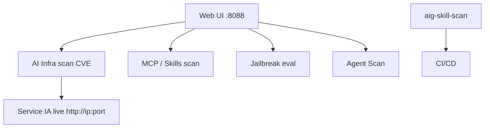

# Tencent/AI-Infra-Guard

> Plateforme de red teaming IA (Tencent Zhuque Lab) : scan de vulnérabilités infra IA, MCP, skills, jailbreak.

## Le problème
Auto-évaluer la sécurité d'une infra IA (serveurs de modèles, MCP, skills d'agents, jailbreak) exige de multiples outils dispersés et une base de CVE à jour.

## Ce que ça fait vraiment
Intègre ClawScan (scan sécurité OpenClaw), Agent Scan (framework multi-agent pour workflows Dify/Coze), scan MCP Server & Agent Skills (14 catégories de risques, source ou URL), scan de vulnérabilités infra IA (100+ composants — Ollama, ComfyUI, vLLM, n8n, Triton — 2000+ CVE), et évaluation de jailbreak. `aig-skill-scan` en CLI pour CI/CD (taxonomie SkillTrustBench T01-T09). API Relay Checker (fingerprinting de modèles).

## Comment c'est branché


## Essayer
```bash
git clone https://github.com/Tencent/AI-Infra-Guard.git
cd AI-Infra-Guard
docker-compose -f docker-compose.images.yml up -d
```
```bash
pip install aig-skill-scan
export LLM_API_KEY="your-api-key"
aig-skill-scan --repo /path/to/your/skill -m deepseek-v4-flash --language en -o result.json
```

## Coût et pièges
Gratuit (Apache 2.0), 4 Go+ RAM, Docker 20.10+. Clé LLM requise pour skill-scan. **Pas d'authentification** : ne pas déployer sur réseau public. Version Pro en ligne sur invitation.

## Ce que ce n'est pas
Pas un pare-feu ni une protection runtime : un scanner d'audit offensif. Positionné usage interne entreprise/individu.

## Alternatives
- A.S.E (AICGSecEval) : évaluation de sécurité du code IA-généré (même éditeur), cité comme complémentaire.

## Pour toi
Directement pertinent pour auditer une infra IA (vLLM, Ollama, MCP, skills) avant mise en prod ; à connaître.
