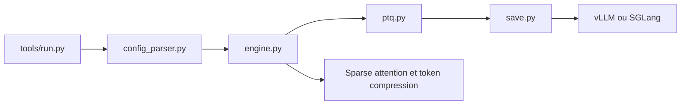

# Tencent/AngelSlim

> Boîte à outils de compression de grands modèles : quantification, décodage spéculatif, attention creuse, élagage de tokens.

## Le problème
Déployer de gros modèles coûte cher en mémoire et en latence ; chaque méthode de compression a son propre outillage.

## Ce que ça fait vraiment
Un moteur de compression avec fichiers de configuration YAML : quantification post-entraînement (FP8 statique et dynamique, INT8, INT4 GPTQ/AWQ, NVFP4), entraînement sensible à la quantification et distillation, attention creuse, élagage de tokens visuels, cache pour diffusion, et décodage spéculatif via le sous-module AngelSpec (DFly, MTP). Couvre LLM, modèles vision-langage, diffusion et audio. Sortie déployable avec vLLM ou SGLang.

## Comment c'est branché


## Essayer
```bash
pip install angelslim
python3 tools/run.py -c configs/qwen3/fp8_static/qwen3-1_7b_fp8_static.yaml
bash scripts/deploy/run_vllm.sh --model-path $MODEL_PATH --port 8080 -d 0,1,2,3 -t 4 -p 1 -g 0.8 --max-model-len 4096
```

## Coût et pièges
GPU nécessaire ; la quantification de très gros modèles est annoncée sur une seule carte. L'entraînement spéculatif demande plusieurs GPU, Mooncake et le sous-module à cloner avec `--recursive`. Licence présente mais non reconnue par GitHub.

## Ce que ce n'est pas
Pas un serveur d'inférence : il produit des modèles compressés à servir ailleurs. Les gains de vitesse du décodage spéculatif (jusqu'à 2,86 fois) sont les mesures de l'équipe sur ses propres modèles.

## Alternatives
Aucune alternative nommée dans le README.

## Pour toi
Adopter à l'essai : quantifier un modèle par un fichier de configuration est direct et utile en MLOps, à condition de vérifier la licence avant un usage commercial.

