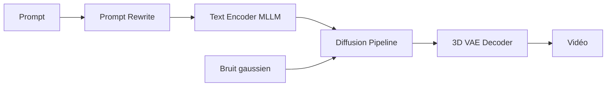

# Tencent/HunyuanVideo

> Modèle ouvert de génération de vidéo à partir de texte (13 milliards de paramètres) avec code d'inférence.

## Le problème
Générer de la vidéo de qualité avec un modèle dont on dispose des poids et du code.

## Ce que ça fait vraiment
Le dépôt contient les définitions PyTorch, les poids et l'inférence : encodeur de texte MLLM, VAE 3D causal, transformeur de diffusion « double flux vers flux unique », réécriture de prompt (modes Normal et Master). Inférence monoGPU, multi-GPU par xDiT, poids FP8, démo Gradio. Le README revendique de meilleurs résultats que des modèles fermés, selon une évaluation humaine interne.

## Comment c'est branché


## Essayer
```bash
python3 sample_video.py \
    --video-size 720 1280 \
    --video-length 129 \
    --infer-steps 50 \
    --prompt "A cat walks on the grass, realistic style." \
    --flow-reverse \
    --use-cpu-offload \
    --save-path ./results
```

## Coût et pièges
Mémoire GPU de pointe : 60 Go pour 720×1280×129 images, 45 Go pour 544×960 ; 80 Go recommandés. Linux testé. Temps de 1904 s sur un GPU pour 720p, 337 s sur 8 GPU. Dernier push le 2026-06-29.

## Ce que ce n'est pas
Pas exécutable sur un GPU grand public sans compromis. La licence est « présente mais non identifiée » : lire le fichier avant tout usage commercial.

## Alternatives
Le README cite mochi-1, CogVideoX, Flux.1 et SD3 comme modèles servis par xDiT.

## Pour toi
À surveiller : référence utile pour la génération vidéo ouverte, mais le coût matériel et la licence incertaine limitent l'adoption.
