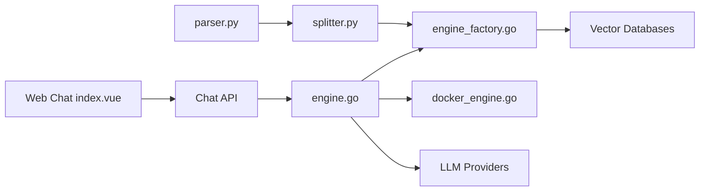

# Tencent/WeKnora

> Plateforme auto-hébergée de RAG, agents ReAct et wiki automatique sur documents d'entreprise.

## Le problème
Transformer des documents épars (PDF, Office, wikis) en base interrogeable avec citations, droits et traçabilité demande d'assembler beaucoup de briques.

## Ce que ça fait vraiment
Ingestion multi-formats et multi-sources (Feishu, GitLab, Notion, RSS…), découpage, indexation BM25/dense/GraphRAG.
Q&A RAG rapide, agent ReAct avec MCP, sandboxes Docker/E2B et recherche web ; mode Wiki généré par agents avec historique.
Multi-workspace RBAC, clés d'API scopées, traçage Langfuse, canaux IM (Slack, Telegram…).
Vector DB interchangeables : pgvector, Elasticsearch, Milvus, Qdrant…

## Comment c'est branché


## Essayer
```bash
git clone https://github.com/Tencent/WeKnora.git
cd WeKnora
cp .env.example .env
docker compose pull
docker compose up -d
```

## Coût et pièges
Gratuit, clé d'API LLM à ta charge (ou Ollama). Profils Docker supplémentaires (Neo4j, MinIO, Langfuse). À ne pas exposer sur Internet selon le README.

## Ce que ce n'est pas
Pas une bibliothèque RAG légère : c'est une plateforme complète à opérer. Écosystème fortement orienté outils chinois (WeChat, Feishu).

## Alternatives
Aucune alternative nommée dans le README.

## Pour toi
Surveiller : référence utile pour une base de connaissances interne avec RBAC, mais lourde à exploiter ; licence à vérifier avant tout pilote.
