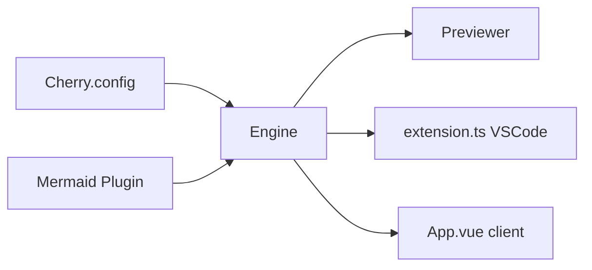

# Tencent/cherry-markdown

> Éditeur Markdown en JavaScript pur, navigateur ou Node, avec rendu en flux pour les chats IA.

## Le problème
Intégrer un éditeur Markdown riche (diagrammes, formules, tableaux) sans dépendre d'un framework front.

## Ce que ça fait vraiment
Un moteur (`Engine`, `Previewer`, `Cherry.config`) transforme le Markdown en HTML, avec filtrage XSS (DomPurify). Des plugins ajoutent Mermaid et PlantUML. Le mode Stream complète les fragments inachevés pendant l'arrivée des tokens. Un client Tauri et une extension VSCode existent.

## Comment c'est branché


## Essayer
```bash
npm install cherry-markdown --save
```

## Coût et pièges
Gratuit. La licence est présente mais non reconnue par GitHub : à lire avant usage commercial.

## Ce que ce n'est pas
Ce n'est pas un rendu de chat clé en main : le mode Stream est un des builds (Full, Core, Stream, Engine) à choisir.

## Alternatives
Aucune alternative nommée dans le README.

## Pour toi
À surveiller : utile pour afficher proprement les sorties d'un LLM en streaming dans une interface web, si la licence convient.

