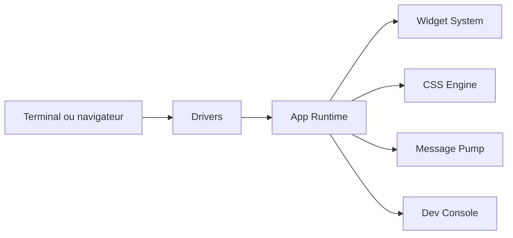

# Textualize/textual

> Framework Python pour construire des interfaces qui tournent dans le terminal ou dans un navigateur.

## Le problème
Écrire une interface interactive (tableaux, formulaires, éditeur) pour un outil interne oblige à monter un front web, alors que le terminal suffirait.

## Ce que ça fait vraiment
Une application déclare ses widgets, les style en CSS et réagit à des événements. Le cœur gère DOM, CSS, système réactif, boucle de messages, workers et animation ; des pilotes isolent Linux, Windows, le web et le mode headless. Des outils de dev (`textual-dev`) fournissent une console de débogage, une palette de commandes et un cadre de test.

## Comment c'est branché


## Essayer
```bash
pip install textual textual-dev
python -m textual
uvx --python 3.12 textual-demo
textual serve "python -m textual"
```

## Coût et pièges
Gratuit. `uvx` est requis pour la démo sans installation. Le mode asynchrone existe mais n'est pas obligatoire.

## Ce que ce n'est pas
Ce n'est pas une bibliothèque de graphiques scientifiques ; c'est un cadre d'interface. Le service Textual Web, cité pour le partage, est un service distinct.

## Alternatives
Aucune alternative nommée dans le README.

## Pour toi
À adopter pour donner une interface soignée à tes scripts et outils MLOps en terminal (suivi d'entraînement, exploration de données) sans écrire de front web.

