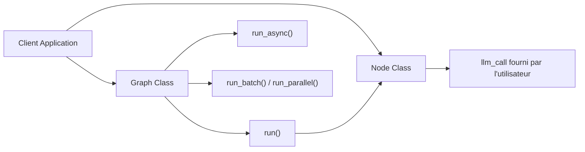

# The-Pocket/PocketFlow

> Micro-framework Python d'orchestration LLM en graphe, pour qui veut des agents sans dépendances lourdes.

## Le problème
Les frameworks LLM (LangChain, CrewAI…) embarquent des centaines de milliers de lignes et des wrappers fournisseurs. Difficile de comprendre ou d'auditer ce qui s'exécute.

## Ce que ça fait vraiment
Un seul module (`pocketflow/__init__.py`, ~100 lignes) définit Node, Flow/Graph et leurs modes d'exécution (sync, async, batch, parallèle).
L'appel LLM est fourni par ton code : aucun SDK fournisseur importé.
Agents, RAG, map-reduce, multi-agents se construisent en composant des nœuds.
Une quarantaine de tutoriels (chat, RAG, MCP, A2A, text2SQL, coding agent) servent de gabarits.

## Comment c'est branché


## Essayer
```bash
pip install pocketflow
```

## Coût et pièges
Gratuit ; tu paies le fournisseur LLM que tu branches. Aucune intégration fournie : tout (retries, outils, mémoire) est à écrire.

## Ce que ce n'est pas
Pas une plateforme d'agents clé en main ni un catalogue d'intégrations. Le discours « agentic coding » (laisser Cursor écrire l'agent) est une méthode, pas une fonctionnalité du code.

## Alternatives
- LangGraph : même abstraction graphe, avec persistance (SqliteSaver…) si tu en as besoin.
- CrewAI : si tu veux des outils et rôles d'agents préfabriqués.
- SmolAgent : agents orientés code avec outils Hugging Face.

## Pour toi
À surveiller : excellent support pédagogique pour comprendre l'orchestration d'agents, mais pour de la prod MLOps il faudra réécrire l'outillage que LangGraph fournit déjà.
