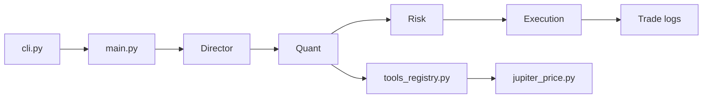

# The-Swarm-Corporation/AutoHedge

> Pipeline d'agents LLM qui analyse le marché crypto et passe des ordres sur Solana.

## Le problème
Enchaîner thèse d'investissement, analyse quantitative, dimensionnement du risque et exécution demande beaucoup de glue entre données et courtiers.

## Ce que ça fait vraiment
Quatre agents en série (framework Swarms) : Director (thèse), Quant (analyse), Risk (taille de position), Execution (ordres).
Outils de données : Jupiter (prix, recherche), Polygon, Yahoo, Exa.
Exécution sur Solana avec la clé privée du portefeuille ; journaux de trades en CSV.
Dossier `experimental/` : market making, agent BTC.

## Comment c'est branché


## Essayer
```bash
pip install -U autohedge
autohedge
```

## Coût et pièges
Clés Jupiter, OpenAI, Anthropic à ta charge, plus `WALLET_PRIVATE_KEY` : ce sont de vrais fonds qui partent.

## Ce que ce n'est pas
Pas un fonds « de niveau entreprise » malgré le README : aucun backtest ni résultat publié. Coinbase et autres places sont seulement annoncés.

## Alternatives
Aucune alternative nommée dans le README.

## Pour toi
À ignorer : confier une clé privée de portefeuille à une chaîne de LLM sans validation mesurée relève du pari, pas de l'ingénierie.
