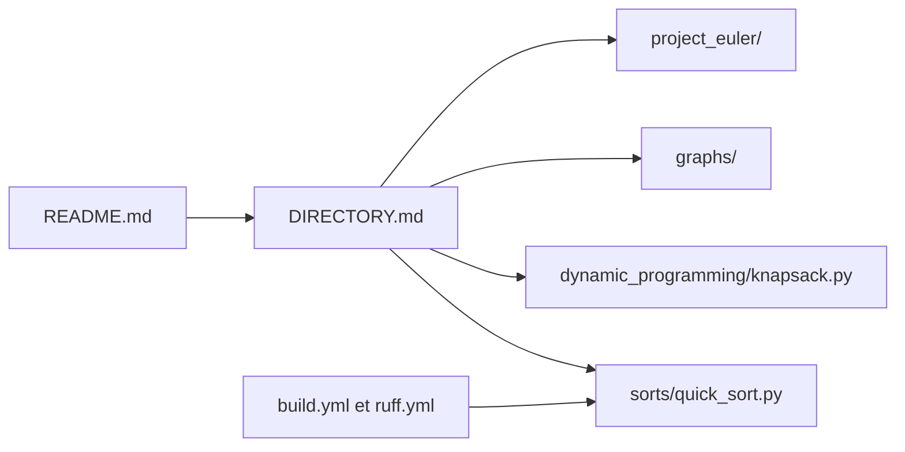

# TheAlgorithms/Python

> Collection d'algorithmes écrits en Python à des fins d'apprentissage, pour étudiants et curieux.

## Le problème
Comprendre un algorithme classique demande de le voir écrit simplement, sans les optimisations d'une bibliothèque standard.

## Ce que ça fait vraiment
Des modules Python indépendants, rangés par sujet : `sorts/`, `searches/`, `dynamic_programming/`, `graphs/`, `data_structures/`, `maths/`, `machine_learning/`, `ciphers/`, plus un dossier `project_euler/`. Le README fait quelques lignes et prévient : les implémentations sont pédagogiques et peuvent être moins efficaces que la bibliothèque standard.

## Comment c'est branché

## Essayer
Aucune commande documentée dans le README (fiche minimale, README de moins de 800 caractères).

## Coût et pièges
Gratuit. Pas de dépendance commune : chaque module peut tirer ses propres imports, et certains scripts (`web_programming/`) appellent des sites tiers.

## Ce que ce n'est pas
Pas une bibliothèque à installer en production : le README déconseille de s'y fier pour la performance. Il n'y a pas de point d'entrée unique.

## Alternatives
Aucune alternative nommée dans le README.

## Pour toi
À surveiller comme référence de lecture (tris, graphes, ML de base) : utile pour comprendre, à ne pas importer dans un pipeline.

