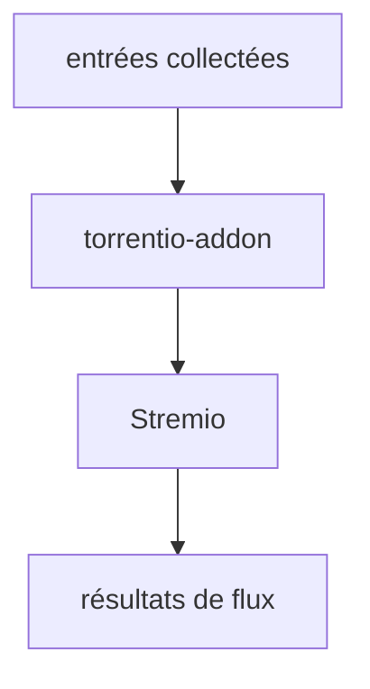

# TheBeastLT/torrentio-scraper

> Collecteur de torrents alimentant un module complémentaire Stremio.

## Le problème
Non documenté : le README ne décrit ni le problème, ni le public visé.

## Ce que ça fait vraiment
Le README tient en deux lignes. Il ne décrit qu'un composant, `torrentio-addon` : le module Stremio qui interroge les entrées collectées et renvoie des résultats de flux à Stremio.
La partie collecte elle-même, le stockage des entrées et le déploiement ne sont pas documentés ici.
Rien n'indique les dépendances, la configuration ni les sources interrogées.

## Comment c'est branché

## Essayer
Aucune commande documentée dans ce README.

## Coût et pièges
Non documenté. Aucune information sur l'hébergement, les quotas ou les dépendances externes.

## Ce que ce n'est pas
Ce n'est pas un lecteur ni un client : il ne fait que fournir des flux à Stremio.
Le README ne permet pas de savoir si le dépôt est utilisable en l'état, ni sous quelle licence.
Rien ne documente la légalité des sources interrogées, ce qui reste à la charge de l'utilisateur.

## Alternatives
Aucune alternative nommée dans le README.

## Pour toi
Sans rapport avec un usage data / IA / MLOps, et sans matière pour décider quoi que ce soit.
