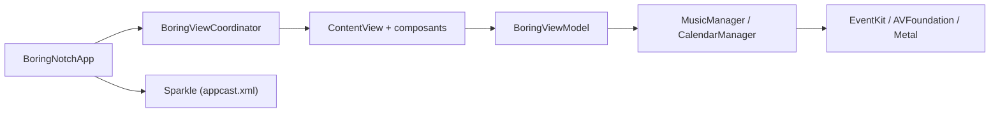

# TheBoredTeam/boring.notch

> Application macOS qui transforme l'encoche du MacBook en centre de contrôle musique, calendrier et dépôt de fichiers.

## Le problème
L'encoche des MacBook est de l'espace d'écran perdu, sans usage.

## Ce que ça fait vraiment
Application SwiftUI (macOS 14+) : contrôles musicaux avec visualiseur (shader Metal), intégration calendrier (EventKit), étagère de fichiers avec AirDrop, remplacement du HUD système, webcam. Architecture MVVM avec coordinateur ; mises à jour via Sparkle.

## Comment c'est branché


## Essayer
```bash
brew install --cask TheBoredTeam/boring-notch/boring-notch
xattr -dr com.apple.quarantine /Applications/boringNotch.app
```

## Coût et pièges
Gratuit. L'application n'est pas signée (pas de compte développeur Apple) : macOS avertit au premier lancement. Compilation depuis les sources : macOS 15.6+ et Xcode 26+. 366 issues ouvertes.

## Ce que ce n'est pas
Ni un outil de productivité pour développeurs data, ni multiplateforme : il ne fonctionne que sur Mac avec encoche. La licence GPL-3.0 impose le copyleft à toute redistribution modifiée.

## Alternatives
NotchDrop (cité comme source d'inspiration de l'étagère).

## Pour toi
À ignorer : gadget d'interface macOS sans lien avec un travail data/IA/MLOps.

